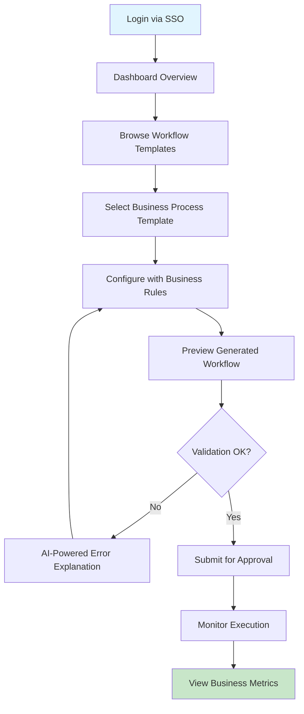
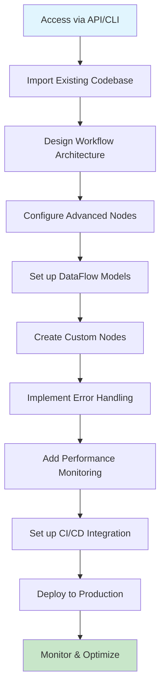
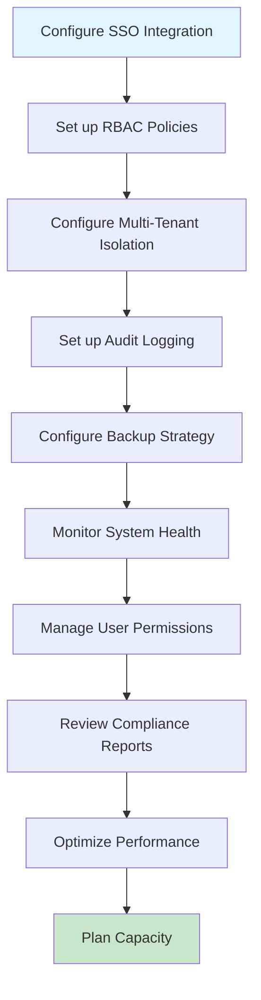

# Kailash Studio - Requirements Analysis Report

## Executive Summary

**Feature**: Visual Workflow Platform for Kailash Ecosystem
**Complexity**: High
**Risk Level**: Medium-High
**Estimated Effort**: 60-90 days (3 phases)
**Strategic Priority**: P0 (DataFlow integration), P1 (Core workflows), P2 (Enterprise features)

### Key Findings
Based on ultrathink-analyst recommendations and codebase analysis:
- **DataFlow-first strategy** offers highest ROI for business users
- **Progressive framework integration** reduces implementation risk
- **Real-time validation** and **AI-powered node discovery** are critical success factors
- **Enterprise security** patterns already established in existing SDKs

---

## Functional Requirements Matrix

### Core Platform Requirements (P0)

| Requirement ID | Description | Input | Output | Business Logic | Edge Cases | SDK Mapping |
|----------------|-------------|-------|---------|----------------|------------|-------------|
| **REQ-001** | Visual workflow builder | User interactions, drag/drop | Workflow definition JSON | Node placement, connection validation | Invalid connections, circular dependencies | WorkflowBuilder, ValidationEngine |
| **REQ-002** | DataFlow model visualization | @db.model definitions | Visual data models + auto-generated nodes | Parse model metadata, generate CRUD nodes | Complex relationships, validation errors | DataFlow model registry, node generation |
| **REQ-003** | Real-time workflow validation | Workflow JSON, node parameters | Validation results, error highlights | Parameter validation, connection integrity | Missing inputs, type mismatches | ParameterDeclarationValidator |
| **REQ-004** | Workflow execution engine | Workflow definition, runtime params | Execution results, logs | Orchestrate LocalRuntime execution | Runtime errors, timeouts | LocalRuntime, WorkflowGraph |
| **REQ-005** | Node library browser | Search queries, filters | Available nodes, documentation | Search SDK nodes, custom nodes | Large node sets, missing docs | NodeRegistry, documentation system |

### DataFlow Integration Requirements (P0)

| Requirement ID | Description | Input | Output | Business Logic | Edge Cases | SDK Mapping |
|----------------|-------------|-------|---------|----------------|------------|-------------|
| **REQ-006** | Database schema visualization | DataFlow models | Visual schema diagram | Parse model relationships, generate ERD | Complex schemas, circular refs | DataFlow metadata, relationship analysis |
| **REQ-007** | Auto-generated CRUD workflows | Model selection | Complete CRUD workflow | Generate Create/Read/Update/Delete flows | Validation rules, permissions | Generated DataFlow nodes |
| **REQ-008** | Query builder interface | Visual query construction | SQL/filter parameters | Build complex queries visually | Invalid queries, performance | DataFlow query patterns |
| **REQ-009** | Migration workflow designer | Schema changes | Migration workflow | Design safe schema evolution | Data integrity, rollback needs | DataFlow migration system |
| **REQ-010** | Multi-database management | Database connections | Unified interface | Manage PostgreSQL + SQLite instances | Connection failures, sync issues | DataFlow multi-instance support |

### AI-Powered Features Requirements (P1)

| Requirement ID | Description | Input | Output | Business Logic | Edge Cases | SDK Mapping |
|----------------|-------------|-------|---------|----------------|------------|-------------|
| **REQ-011** | Natural language workflow generation | User requirements in English | Generated workflow | Parse intent, map to nodes, create flow | Ambiguous requests, impossible flows | LLMAgentNode, prompt engineering |
| **REQ-012** | Intelligent node suggestions | Partial workflow, context | Recommended next nodes | Analyze workflow pattern, suggest completions | No suggestions, wrong suggestions | Pattern analysis, ML models |
| **REQ-013** | Auto-parameter inference | Node selection, context | Pre-filled parameters | Infer likely parameter values | Incorrect inference, validation fails | Parameter analysis, historical data |
| **REQ-014** | Workflow optimization recommendations | Existing workflow | Performance suggestions | Analyze bottlenecks, suggest improvements | False positives, edge cases | Performance profiling, best practices |
| **REQ-015** | Error explanation and fixes | Runtime errors | Plain English explanations + fixes | Parse SDK exceptions, provide solutions | Unknown errors, complex issues | SDK error patterns, solution database |

### Enterprise Requirements (P1)

| Requirement ID | Description | Input | Output | Business Logic | Edge Cases | SDK Mapping |
|----------------|-------------|-------|---------|----------------|------------|-------------|
| **REQ-016** | Single Sign-On integration | SSO credentials | Authenticated user | Integrate with enterprise SSO providers | SSO failures, token expiry | Nexus authentication system |
| **REQ-017** | Role-based access control | User roles, permissions | Restricted UI + actions | Control feature access by role | Permission conflicts, inheritance | Nexus RBAC system |
| **REQ-018** | Multi-tenant isolation | Tenant context | Isolated workflows + data | Separate tenant environments | Cross-tenant leaks, resource limits | Nexus multi-tenant architecture |
| **REQ-019** | Audit logging | User actions | Compliance logs | Track all user activities | Log tampering, storage limits | Enterprise audit patterns |
| **REQ-020** | Workflow approval processes | Workflow submissions | Approval workflows | Route workflows through approval chains | Approval bottlenecks, escalations | Business process patterns |

### Integration Requirements (P2)

| Requirement ID | Description | Input | Output | Business Logic | Edge Cases | SDK Mapping |
|----------------|-------------|-------|---------|----------------|------------|-------------|
| **REQ-021** | Git version control | Workflow changes | Version history | Track workflow versions, branching | Merge conflicts, large files | Git integration patterns |
| **REQ-022** | CI/CD pipeline integration | Git commits | Automated testing + deployment | Trigger workflow tests on changes | Test failures, deployment issues | Testing framework, automation |
| **REQ-023** | External system connectors | API configurations | Live data connections | Connect to external APIs, databases | API changes, auth failures | HTTPClient, RESTClient nodes |
| **REQ-024** | Marketplace integration | Workflow sharing | Community workflows | Publish/discover workflows | Quality control, licensing | Nexus marketplace system |
| **REQ-025** | Export/import capabilities | Various formats | Workflow portability | Support multiple export formats | Format compatibility, data loss | Serialization systems |

---

## Non-Functional Requirements

### Performance Requirements
```yaml
Response Time:
  - UI interactions: <100ms (target: <50ms)
  - Workflow validation: <200ms
  - Simple workflow execution: <500ms
  - Complex workflow execution: <5s
  - DataFlow model loading: <300ms

Throughput:
  - Concurrent users: 100+ (target: 500+)
  - Workflow executions: 10/second per user
  - API requests: 1000/minute per user
  - DataFlow operations: 1000/second

Scalability:
  - Memory usage: <2GB per instance
  - Storage: 10GB base + 100MB per 1000 workflows
  - Database: Support 1M+ workflows, 10M+ executions
  - Horizontal scaling: Stateless web tier
```

### Security Requirements
```yaml
Authentication:
  - Multi-factor authentication (MFA)
  - SSO integration (SAML, OAuth2, LDAP)
  - Session management with secure tokens
  - Password policy enforcement

Authorization:
  - Role-based access control (RBAC)
  - Attribute-based access control (ABAC)
  - Resource-level permissions
  - API key management

Data Protection:
  - Encryption at rest (AES-256)
  - Encryption in transit (TLS 1.3)
  - Secrets management integration
  - PII data masking

Compliance:
  - SOC 2 Type II compliance
  - GDPR compliance (EU)
  - HIPAA compliance (healthcare)
  - Audit trail requirements
```

### Scalability Requirements
```yaml
Horizontal Scaling:
  - Stateless application design
  - Database connection pooling
  - Redis session storage
  - Load balancer support

Vertical Scaling:
  - Multi-core CPU utilization
  - Memory-efficient operations
  - Database query optimization
  - Caching strategies

Resource Management:
  - CPU usage: <70% under normal load
  - Memory usage: Predictable growth patterns
  - Database connections: Pooled and limited
  - File storage: Configurable limits
```

### Availability Requirements
```yaml
Uptime:
  - Target: 99.9% (8.77 hours downtime/year)
  - Stretch: 99.99% (52 minutes downtime/year)

Recovery:
  - RTO (Recovery Time Objective): <30 minutes
  - RPO (Recovery Point Objective): <5 minutes
  - Automated failover: <2 minutes
  - Backup frequency: Every 4 hours

Monitoring:
  - Health checks every 30 seconds
  - Performance metrics collection
  - Error rate monitoring
  - User experience monitoring
```

---

## User Journey Mappings

### Business User Journey (Primary Persona)

**Profile**: Non-technical stakeholder needing automated business processes
**Technical Level**: Basic
**Primary Goals**: Create workflows without coding, understand business metrics



**Success Criteria**:
- [ ] Can create workflow in <10 minutes without technical help
- [ ] Understands error messages in plain English
- [ ] Can modify business rules without breaking workflow
- [ ] Receives clear business metrics and reports

**Failure Points**:
- Complex technical interfaces
- Cryptic error messages
- No business context in reports
- Approval process bottlenecks

### Technical Developer Journey (Secondary Persona)

**Profile**: Experienced developer building complex automation
**Technical Level**: Advanced
**Primary Goals**: Build sophisticated workflows, integrate with existing systems



**Success Criteria**:
- [ ] Can integrate with existing dev workflow
- [ ] Has access to all advanced features
- [ ] Can extend platform with custom nodes
- [ ] Gets detailed performance metrics

**Failure Points**:
- Limited API access
- Poor integration with dev tools
- Insufficient monitoring data
- No extensibility options

### Platform Administrator Journey

**Profile**: IT administrator managing enterprise deployment
**Technical Level**: Expert
**Primary Goals**: Ensure security, compliance, and performance



**Success Criteria**:
- [ ] Full control over security policies
- [ ] Complete audit trail visibility
- [ ] Automated compliance reporting
- [ ] Predictable performance scaling

**Failure Points**:
- Insufficient security controls
- Poor audit trail quality
- Manual compliance processes
- Unpredictable resource usage

---

## Technical Architecture Requirements

### Frontend Architecture
```yaml
Technology Stack:
  - Framework: React 18+ with TypeScript
  - State Management: Redux Toolkit + RTK Query
  - UI Components: Material-UI v5 or equivalent
  - Visualization: D3.js for workflow graphs
  - Build Tool: Vite for fast development

Core Components:
  - WorkflowCanvas: Drag-and-drop workflow builder
  - NodeLibrary: Searchable node browser
  - PropertyPanel: Node configuration interface
  - ExecutionMonitor: Real-time execution tracking
  - DataModelDesigner: Visual database schema editor

Performance Requirements:
  - Initial load: <3 seconds
  - Canvas rendering: 60fps
  - Node operations: <100ms response
  - Memory usage: <500MB browser
```

### Backend Architecture
```yaml
API Layer:
  - Framework: FastAPI with async support
  - Authentication: JWT with refresh tokens
  - Documentation: Auto-generated OpenAPI/Swagger
  - Rate Limiting: Per-user and per-endpoint

Business Logic:
  - Workflow Management: Core SDK integration
  - DataFlow Integration: Direct model access
  - Validation Engine: Real-time parameter checking
  - Execution Engine: LocalRuntime orchestration

Data Storage:
  - Primary Database: PostgreSQL for metadata
  - Cache Layer: Redis for sessions and temp data
  - File Storage: S3-compatible for workflow exports
  - Search Index: Elasticsearch for node discovery
```

### Integration Architecture
```yaml
SDK Integration:
  - Core SDK: Direct Python imports
  - DataFlow: Model introspection and node generation
  - Nexus: Multi-channel deployment support
  - MCP: AI agent interaction capabilities

External Integrations:
  - Git Providers: GitHub, GitLab, Bitbucket
  - SSO Providers: Active Directory, Okta, Auth0
  - Monitoring: Prometheus, Grafana, DataDog
  - Storage: AWS S3, Azure Blob, Google Cloud Storage

Communication:
  - WebSocket: Real-time execution updates
  - REST API: Standard CRUD operations
  - GraphQL: Flexible data querying (optional)
  - Message Queue: Background job processing
```

---

## Enterprise Requirements Specification

### Single Sign-On (SSO) Integration
```yaml
Supported Protocols:
  - SAML 2.0: Enterprise identity providers
  - OAuth 2.0/OpenID Connect: Modern cloud providers
  - LDAP/Active Directory: Legacy enterprise systems

Configuration:
  - Multi-provider support: Up to 10 SSO providers
  - Provider precedence: Configurable priority order
  - Fallback authentication: Local accounts as backup
  - Group mapping: Automatic role assignment from SSO groups

Security Features:
  - Certificate validation: Full chain verification
  - Token encryption: At-rest and in-transit
  - Session management: Configurable timeout and renewal
  - Audit logging: All authentication events tracked
```

### Role-Based Access Control (RBAC)
```yaml
Permission Model:
  - Actions: create, read, update, delete, execute, admin
  - Resources: workflows, nodes, models, users, system
  - Scopes: global, tenant, project, individual

Built-in Roles:
  - Super Admin: Full system access
  - Tenant Admin: Full tenant access
  - Developer: Create and manage workflows
  - Business User: Execute approved workflows
  - Viewer: Read-only access

Custom Roles:
  - Permission combinations: Granular control
  - Inheritance: Role hierarchy support
  - Conditions: Time-based, IP-based restrictions
  - Review process: Periodic access reviews
```

### Multi-Tenant Architecture
```yaml
Isolation Levels:
  - Strict: Complete data and compute isolation
  - Moderate: Shared compute, isolated data
  - Relaxed: Shared resources with logical separation

Resource Management:
  - Compute limits: CPU, memory per tenant
  - Storage limits: Database, file storage quotas
  - API limits: Rate limiting per tenant
  - Feature toggles: Per-tenant feature enabling

Data Segregation:
  - Database: Schema-level or database-level isolation
  - File storage: Path-based tenant separation
  - Cache: Tenant-prefixed keys
  - Logs: Tenant-tagged log entries
```

### Compliance Requirements
```yaml
Audit Logging:
  - Events: All user actions, system changes, data access
  - Format: JSON with structured fields
  - Storage: Immutable append-only logs
  - Retention: Configurable (default: 7 years)

Data Protection:
  - Encryption: AES-256 at rest, TLS 1.3 in transit
  - Key management: Hardware security modules (HSM)
  - PII handling: Automatic detection and masking
  - Right to deletion: GDPR compliance features

Compliance Reports:
  - SOC 2: Automated control evidence collection
  - HIPAA: PHI access tracking and reporting
  - GDPR: Data processing activity reports
  - Custom: Configurable compliance frameworks
```

---

## AI Assistant Requirements

### Natural Language Processing
```yaml
Intent Recognition:
  - Business processes: "Create an approval workflow for expenses"
  - Data operations: "Set up customer database with email validation"
  - Integration tasks: "Connect to Salesforce and sync contacts"
  - Performance optimization: "Make this workflow faster"

Context Understanding:
  - Domain knowledge: Business process terminology
  - Technical concepts: Database, API, workflow concepts
  - User history: Previous workflows and preferences
  - Current state: Existing workflow context

Response Generation:
  - Workflow creation: Generate complete workflows from descriptions
  - Code generation: Create custom node implementations
  - Documentation: Generate workflow documentation
  - Explanations: Explain complex workflows in simple terms
```

### Workflow Generation Accuracy
```yaml
Success Metrics:
  - Intent accuracy: >95% correct interpretation
  - Workflow validity: >90% generated workflows execute successfully
  - Parameter accuracy: >85% parameters set correctly
  - User satisfaction: >4.5/5 rating on generated workflows

Error Handling:
  - Ambiguity detection: Identify unclear requirements
  - Clarification requests: Ask specific follow-up questions
  - Alternative suggestions: Provide multiple workflow options
  - Graceful degradation: Partial workflows when full generation fails

Continuous Learning:
  - User feedback: Learn from corrections and preferences
  - Usage patterns: Identify common workflow templates
  - Performance tracking: Monitor generation success rates
  - Model updates: Regular retraining with new data
```

### AI-Powered Node Discovery
```yaml
Recommendation Engine:
  - Context analysis: Understand current workflow state
  - Pattern matching: Identify similar successful workflows
  - Capability mapping: Match requirements to available nodes
  - Performance consideration: Suggest optimal node choices

Discovery Methods:
  - Semantic search: Natural language node descriptions
  - Example-based: "Find nodes like HTTPRequestNode"
  - Use case driven: "I need to send emails"
  - Integration focused: "Connect to Slack"

Quality Metrics:
  - Relevance score: How well suggestions match requirements
  - Success rate: Percentage of accepted suggestions
  - Discovery speed: Time to find relevant nodes
  - User productivity: Workflow completion time improvement
```

---

## Integration Requirements

### Core SDK Integration
```yaml
WorkflowBuilder Integration:
  - Direct import: from kailash.workflow.builder import WorkflowBuilder
  - Node registry access: Real-time node discovery
  - Validation integration: Use existing parameter validators
  - Export compatibility: Standard workflow JSON format

Runtime Integration:
  - LocalRuntime: Execute workflows in development
  - ProductionRuntime: Deploy to production environments
  - Monitoring: Real-time execution tracking
  - Debugging: Step-by-step execution analysis

Node Ecosystem:
  - Built-in nodes: Access to 110+ SDK nodes
  - Custom nodes: Support for user-defined nodes
  - Node documentation: Auto-generated from docstrings
  - Node testing: Integrated testing framework
```

### DataFlow Deep Integration
```yaml
Model Introspection:
  - Model discovery: Automatic detection of @db.model classes
  - Schema analysis: Extract fields, types, relationships
  - Constraint detection: Identify validation rules
  - Migration tracking: Monitor schema changes

Auto-Generated Workflows:
  - CRUD operations: Complete Create/Read/Update/Delete flows
  - Business processes: Model-based approval workflows
  - Data validation: Automated data quality checks
  - Reporting: Standard model-based reports

Visual Schema Design:
  - ERD generation: Automatic entity-relationship diagrams
  - Relationship visualization: Foreign key connections
  - Index recommendations: Performance optimization suggestions
  - Migration planning: Visual schema evolution
```

### Nexus Platform Integration
```yaml
Multi-Channel Deployment:
  - API generation: Auto-generate REST endpoints
  - CLI commands: Export workflows as CLI tools
  - MCP tools: Make workflows available to AI agents
  - Documentation: Auto-generate API documentation

Enterprise Features:
  - Authentication: Leverage Nexus SSO capabilities
  - Multi-tenancy: Use Nexus tenant isolation
  - Monitoring: Integrate with Nexus observability
  - Marketplace: Publish workflows to Nexus marketplace

Unified Management:
  - Single deployment: One command deployment to all channels
  - Consistent auth: Same auth across all access methods
  - Shared monitoring: Unified metrics and logging
  - Cross-channel sync: Real-time updates across channels
```

### Kaizen AI Integration
```yaml
Intelligent Assistance:
  - Workflow optimization: Kaizen-powered suggestions
  - Code generation: AI-generated custom nodes
  - Documentation: Auto-generated workflow documentation
  - Troubleshooting: AI-powered error resolution

Learning Capabilities:
  - Pattern recognition: Learn from successful workflows
  - User preferences: Adapt to individual working styles
  - Best practices: Suggest industry-standard patterns
  - Performance optimization: AI-driven performance tuning

Knowledge Base:
  - SDK documentation: Complete knowledge of all nodes
  - Best practices: Curated workflow patterns
  - Common solutions: Solutions to frequent problems
  - Community knowledge: Learn from user contributions
```

---

## Success Metrics and Acceptance Criteria

### User Experience Metrics
```yaml
Adoption Metrics:
  - Time to first workflow: <15 minutes
  - Daily active users: >70% of registered users
  - Workflow completion rate: >85%
  - User retention: >80% after 30 days

Productivity Metrics:
  - Workflow creation speed: 5x faster than code
  - Error reduction: 60% fewer runtime errors
  - Documentation time: 80% reduction in manual docs
  - Onboarding time: 75% faster for new users

Satisfaction Metrics:
  - Net Promoter Score (NPS): >50
  - User satisfaction: >4.5/5
  - Support ticket reduction: >40%
  - Feature adoption: >60% for core features
```

### Technical Performance Metrics
```yaml
Performance Benchmarks:
  - Page load time: <2 seconds (95th percentile)
  - Workflow validation: <200ms
  - Node operations: <100ms
  - Database queries: <50ms

Reliability Metrics:
  - System uptime: >99.9%
  - Error rate: <0.1%
  - Data consistency: 100%
  - Security incidents: 0

Scalability Metrics:
  - Concurrent users: 500+ without degradation
  - Workflow storage: 1M+ workflows
  - Execution throughput: 1000+ workflows/hour
  - Resource efficiency: Linear scaling with load
```

### Business Impact Metrics
```yaml
Cost Reduction:
  - Development time: 70% reduction
  - Maintenance overhead: 50% reduction
  - Training costs: 60% reduction
  - Infrastructure costs: 30% reduction

Revenue Impact:
  - Time to market: 40% faster product delivery
  - Customer satisfaction: 25% improvement
  - Market expansion: New customer segments
  - Competitive advantage: First-mover in visual workflow space

Quality Improvements:
  - Bug reduction: 50% fewer production issues
  - Compliance adherence: 100% audit pass rate
  - Documentation quality: 80% improvement
  - Knowledge sharing: 3x increase in reusable workflows
```

---

## Implementation Roadmap

### Phase 1: Foundation (Days 1-30)
**Focus**: Core platform with DataFlow integration

```yaml
Week 1-2: Infrastructure Setup
  - Backend API foundation (FastAPI)
  - Frontend scaffold (React + TypeScript)
  - Database schema design
  - Authentication framework
  - Basic CI/CD pipeline

Week 3-4: Core Workflow Builder
  - Visual workflow canvas
  - Node library browser
  - Basic drag-and-drop functionality
  - Simple workflow execution
  - Real-time validation

Deliverables:
  - Working prototype demonstrating core functionality
  - DataFlow model visualization
  - Basic workflow creation and execution
  - Developer documentation

Success Criteria:
  - Can create and execute simple workflows
  - DataFlow models render correctly
  - Performance targets met for core operations
```

### Phase 2: AI-Powered Features (Days 31-60)
**Focus**: Intelligent assistance and enterprise features

```yaml
Week 5-6: AI Integration
  - Natural language workflow generation
  - Intelligent node suggestions
  - Auto-parameter inference
  - Error explanation system

Week 7-8: Enterprise Security
  - SSO integration (SAML, OAuth2)
  - RBAC implementation
  - Multi-tenant architecture
  - Audit logging system

Deliverables:
  - AI-powered workflow generation
  - Enterprise authentication system
  - Multi-tenant capability
  - Comprehensive security audit

Success Criteria:
  - >90% accuracy in workflow generation
  - Full SSO integration with major providers
  - Complete tenant isolation
  - SOC 2 compliance readiness
```

### Phase 3: Advanced Features (Days 61-90)
**Focus**: Full SDK integration and marketplace

```yaml
Week 9-10: Complete SDK Integration
  - Nexus multi-channel deployment
  - Advanced DataFlow features
  - Custom node development
  - Performance optimization

Week 11-12: Marketplace and Collaboration
  - Workflow sharing and discovery
  - Version control integration
  - Collaborative editing
  - Advanced analytics

Deliverables:
  - Complete SDK integration
  - Workflow marketplace
  - Collaboration features
  - Production-ready platform

Success Criteria:
  - All SDK frameworks fully integrated
  - Workflow marketplace functional
  - Performance targets exceeded
  - Ready for production deployment
```

---

## Risk Assessment and Mitigation

### High Priority Risks

**Risk 1: UX Complexity**
- **Impact**: High - Poor adoption if interface is too complex
- **Probability**: Medium - Visual workflow builders are inherently complex
- **Mitigation**:
  - Extensive user testing with target personas
  - Progressive disclosure of advanced features
  - AI-powered assistance for complex operations
  - Comprehensive onboarding and tutorials

**Risk 2: SDK Integration Errors**
- **Impact**: High - Core functionality depends on SDK stability
- **Probability**: Medium - Complex integration with multiple frameworks
- **Mitigation**:
  - Comprehensive integration testing
  - Version pinning with controlled upgrades
  - Fallback mechanisms for SDK failures
  - Close collaboration with SDK maintainers

**Risk 3: Performance Degradation**
- **Impact**: Medium - Poor performance affects user experience
- **Probability**: Medium - Complex UI and backend operations
- **Mitigation**:
  - Performance monitoring from day one
  - Load testing throughout development
  - Caching strategies for expensive operations
  - Progressive loading and optimization

### Medium Priority Risks

**Risk 4: AI Generation Accuracy**
- **Impact**: Medium - Poor AI suggestions reduce value proposition
- **Probability**: High - AI systems have inherent limitations
- **Mitigation**:
  - Extensive training data collection
  - User feedback loops for continuous improvement
  - Fallback to manual workflow creation
  - Clear confidence indicators for AI suggestions

**Risk 5: Enterprise Security Requirements**
- **Impact**: High - Security failures block enterprise adoption
- **Probability**: Low - Well-established patterns exist
- **Mitigation**:
  - Security review at each development phase
  - Penetration testing before release
  - Compliance audit preparation
  - Security-first development practices

---

This comprehensive requirements analysis provides the foundation for developing kailash-studio with a clear understanding of user needs, technical constraints, and success criteria. The DataFlow-first strategy aligns with the ultrathink-analyst recommendations while ensuring progressive integration with the broader Kailash ecosystem.
