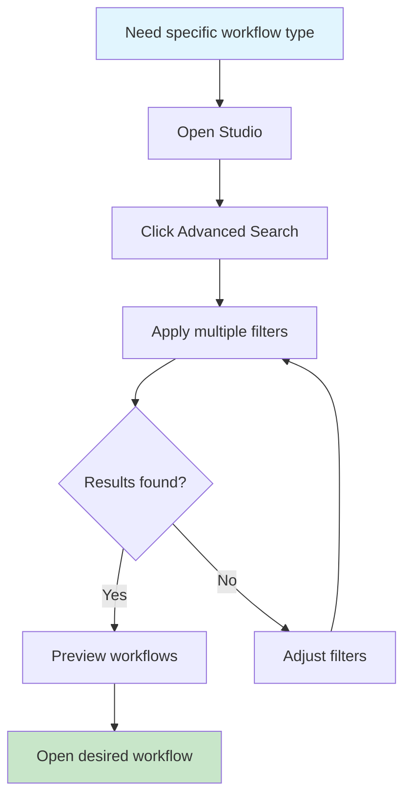
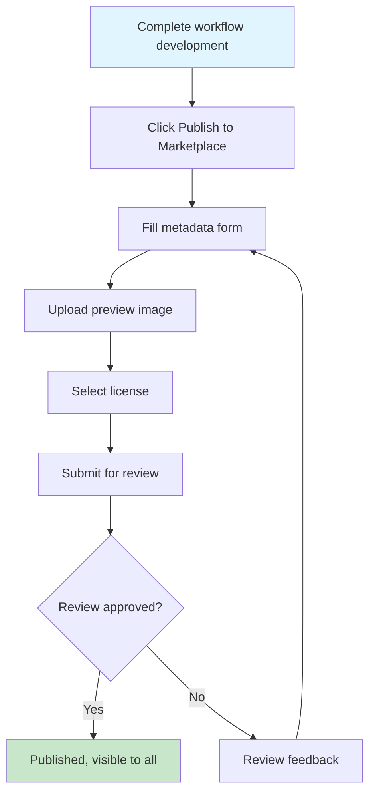
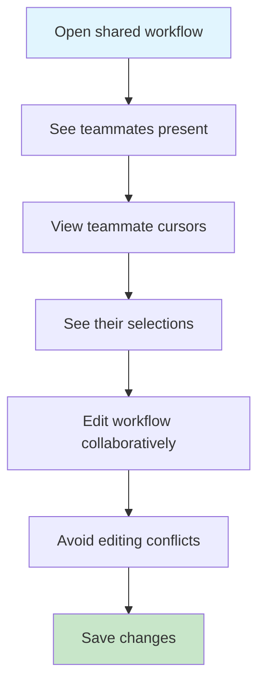

# Kailash Studio - Tier 3 Nice-to-Have Features Requirements Analysis

## Executive Summary

**Features**: 4 Tier 3 Nice-to-Have Features for Kailash Studio
**Total Complexity**: Medium
**Overall Risk Level**: Low-Medium
**Total Estimated Effort**: 22 hours ($61K business value)
**Strategic Priority**: P3 (Post-MVP enhancements)

### Feature Breakdown

| Feature | Hours | Value | Complexity | Risk | Priority |
|---------|-------|-------|------------|------|----------|
| Advanced Search Filters | 4h | $15K | Medium | Low | P3.1 |
| Collaboration Presence Indicators | 3h | $12K | Low | Low | P3.2 |
| Load Testing Scripts | 3h | $10K | Low | Low | P3.3 |
| Community Marketplace UI | 12h | $24K | Medium | Medium | P3.4 |

### Key Findings
- All features are incremental enhancements to existing functionality
- Low technical risk with established architectural patterns
- High user experience value with moderate implementation complexity
- Community Marketplace has highest business value and complexity
- All features leverage existing DataFlow models and API infrastructure

---

## Feature 1: Advanced Search Filters (4h, $15K)

### Functional Requirements Matrix

| Requirement ID | Description | Input | Output | Business Logic | Edge Cases | SDK Mapping |
|----------------|-------------|-------|---------|----------------|------------|-------------|
| **REQ-T3-001** | Multi-criteria workflow search | Search filters (tags, date, author, status) | Filtered workflow list | Build complex SQL queries from filters | Empty results, invalid filters | FindWorkflowNode with advanced filters |
| **REQ-T3-002** | Tag-based filtering | Tag selections | Workflows matching all/any tags | AND/OR logic for tag combinations | No tags, thousands of tags | Workflow.tags JSON array query |
| **REQ-T3-003** | Date range filtering | Start/end dates | Workflows in date range | Query created_at/updated_at fields | Invalid dates, timezone handling | DateTime comparison queries |
| **REQ-T3-004** | Author filtering | User IDs/usernames | Workflows by specific authors | Query created_by field | Deleted users, multiple authors | User lookup + workflow filter |
| **REQ-T3-005** | Status filtering | Status values (draft, published, archived) | Workflows by status | Query status field | Invalid status values | Workflow.status enum query |
| **REQ-T3-006** | Framework type filtering | Framework selections | Workflows by framework | Query framework_type field | Unknown frameworks | Workflow.framework_type query |
| **REQ-T3-007** | Saved search presets | Preset configurations | Quick filter application | Store/retrieve search configs | Preset conflicts, versioning | User preferences JSON |
| **REQ-T3-008** | Search result sorting | Sort criteria | Ordered results | Multi-field sorting logic | Null values, tie-breaking | SQL ORDER BY clauses |

### Non-Functional Requirements

#### Performance Requirements
```yaml
Response Time:
  - Simple filter (1-2 criteria): <100ms
  - Complex filter (5+ criteria): <300ms
  - Tag autocomplete: <50ms
  - Saved preset loading: <100ms

Throughput:
  - Concurrent filter operations: 100+ users
  - Filter updates: Real-time (WebSocket)
  - Autocomplete suggestions: 50 requests/second

Scalability:
  - Support filtering across 100K+ workflows
  - Tag index optimization for fast lookups
  - Pagination for large result sets (50 items/page)
```

#### Accessibility Requirements
```yaml
WCAG AA Compliance:
  - Keyboard navigation for all filter controls
  - Screen reader announcements for filter changes
  - Clear focus indicators on filter inputs
  - ARIA labels for complex filter combinations
  - Color-blind friendly status indicators
```

### Technical Requirements

#### API Contract
```typescript
// GET /api/workflows/search
interface SearchFiltersRequest {
  // Tag filtering
  tags?: string[];              // Tag IDs or names
  tagMode?: 'AND' | 'OR';       // Match all or any tags

  // Date range filtering
  createdAfter?: string;        // ISO 8601 datetime
  createdBefore?: string;       // ISO 8601 datetime
  updatedAfter?: string;        // ISO 8601 datetime
  updatedBefore?: string;       // ISO 8601 datetime

  // Author filtering
  authorIds?: string[];         // User IDs
  authorUsernames?: string[];   // Usernames

  // Status filtering
  statuses?: Array<'draft' | 'published' | 'archived'>;

  // Framework filtering
  frameworkTypes?: Array<'core' | 'dataflow' | 'nexus'>;

  // Project filtering
  projectIds?: string[];

  // Sorting
  sortBy?: 'created_at' | 'updated_at' | 'name' | 'usage_count';
  sortOrder?: 'asc' | 'desc';

  // Pagination
  page?: number;
  pageSize?: number;

  // Organization context
  organizationId: string;
}

interface SearchFiltersResponse {
  workflows: WorkflowSummary[];
  total: number;
  page: number;
  pageSize: number;
  facets: {
    tags: Array<{ tag: string; count: number }>;
    authors: Array<{ userId: string; username: string; count: number }>;
    statuses: Array<{ status: string; count: number }>;
    frameworks: Array<{ framework: string; count: number }>;
  };
  appliedFilters: SearchFiltersRequest;
}

// POST /api/workflows/search/presets
interface SavedSearchPreset {
  id: string;
  name: string;
  description?: string;
  filters: SearchFiltersRequest;
  userId: string;
  organizationId: string;
  isPublic: boolean;
  createdAt: string;
  updatedAt: string;
}
```

#### Data Models
```python
# Extension to User model (via preferences JSON field)
{
  "search_presets": [
    {
      "id": "preset-uuid",
      "name": "My Active Workflows",
      "filters": {
        "statuses": ["draft", "published"],
        "authorIds": ["user-123"],
        "sortBy": "updated_at",
        "sortOrder": "desc"
      }
    }
  ],
  "search_history": [
    {
      "timestamp": "2025-10-05T10:30:00Z",
      "filters": { ... },
      "resultCount": 15
    }
  ]
}
```

#### Component Hierarchy
```typescript
<AdvancedSearchPanel>
  <SearchFilterBar>
    <TagFilter
      tags={availableTags}
      selectedTags={filters.tags}
      tagMode={filters.tagMode}
      onChange={handleTagChange}
    />

    <DateRangeFilter
      label="Created Date"
      startDate={filters.createdAfter}
      endDate={filters.createdBefore}
      onChange={handleDateChange}
    />

    <AuthorFilter
      users={organizationUsers}
      selectedAuthors={filters.authorIds}
      onChange={handleAuthorChange}
    />

    <StatusFilter
      statuses={['draft', 'published', 'archived']}
      selectedStatuses={filters.statuses}
      onChange={handleStatusChange}
    />

    <FrameworkFilter
      frameworks={['core', 'dataflow', 'nexus']}
      selectedFrameworks={filters.frameworkTypes}
      onChange={handleFrameworkChange}
    />
  </SearchFilterBar>

  <SearchPresets>
    <PresetSelector
      presets={savedPresets}
      onSelectPreset={applyPreset}
    />

    <PresetManager
      onSavePreset={saveCurrentFilters}
      onDeletePreset={deletePreset}
    />
  </SearchPresets>

  <SearchResults>
    <ResultList
      workflows={filteredWorkflows}
      onSelectWorkflow={openWorkflow}
    />

    <FacetedNavigation
      facets={searchFacets}
      onFacetClick={addFilter}
    />

    <Pagination
      page={currentPage}
      pageSize={pageSize}
      total={totalResults}
      onPageChange={handlePageChange}
    />
  </SearchResults>
</AdvancedSearchPanel>
```

#### State Management (Zustand)
```typescript
interface SearchFiltersStore {
  // Filter state
  filters: SearchFiltersRequest;
  savedPresets: SavedSearchPreset[];
  searchResults: SearchFiltersResponse | null;
  isLoading: boolean;

  // Actions
  updateFilters: (filters: Partial<SearchFiltersRequest>) => void;
  clearFilters: () => void;
  applyPreset: (presetId: string) => void;
  savePreset: (name: string, description?: string) => Promise<void>;
  deletePreset: (presetId: string) => Promise<void>;
  executeSearch: () => Promise<void>;

  // Computed
  hasActiveFilters: () => boolean;
  getFilterSummary: () => string;
}
```

### Dependencies

#### Backend Dependencies
- **Existing**: Workflow model, User model, FindWorkflowNode
- **New**: Advanced query builder for complex SQL generation
- **Database**: PostgreSQL full-text search, JSON query operators
- **Caching**: Redis for tag autocomplete, facet counts

#### Frontend Dependencies
- **Existing**: Ant Design (DatePicker, Select, Tag, Checkbox)
- **New**: None (all required components exist in Ant Design)
- **State**: Zustand store for filter state
- **WebSocket**: Real-time filter result updates

#### External Services
- None (all functionality is self-contained)

### Test Requirements (TDD Approach)

#### Unit Tests
```python
# Backend: test_advanced_search_filters.py
def test_single_tag_filter():
    """Filter workflows by single tag."""
    # GIVEN: Workflows with various tags
    # WHEN: Filter by tag "data-processing"
    # THEN: Only workflows with that tag returned

def test_multiple_tags_and_mode():
    """Filter workflows by multiple tags with AND logic."""
    # GIVEN: Workflows with tag combinations
    # WHEN: Filter by ["etl", "database"] with AND mode
    # THEN: Only workflows with both tags returned

def test_multiple_tags_or_mode():
    """Filter workflows by multiple tags with OR logic."""
    # GIVEN: Workflows with tag combinations
    # WHEN: Filter by ["etl", "database"] with OR mode
    # THEN: Workflows with either tag returned

def test_date_range_filter():
    """Filter workflows by date range."""
    # GIVEN: Workflows created across different dates
    # WHEN: Filter by createdAfter and createdBefore
    # THEN: Only workflows in range returned

def test_author_filter():
    """Filter workflows by author."""
    # GIVEN: Workflows by different authors
    # WHEN: Filter by specific author ID
    # THEN: Only that author's workflows returned

def test_status_filter():
    """Filter workflows by status."""
    # GIVEN: Workflows with different statuses
    # WHEN: Filter by status "published"
    # THEN: Only published workflows returned

def test_combined_filters():
    """Combine multiple filter criteria."""
    # GIVEN: Workflows with various attributes
    # WHEN: Apply tag + date + author filters
    # THEN: Workflows matching all criteria returned

def test_empty_result_set():
    """Handle filters with no matching results."""
    # GIVEN: Workflows that don't match criteria
    # WHEN: Apply restrictive filters
    # THEN: Empty result set returned gracefully

def test_faceted_navigation():
    """Generate facet counts for search results."""
    # GIVEN: Filtered workflow results
    # WHEN: Request facets
    # THEN: Correct counts for tags, authors, statuses

def test_search_performance():
    """Verify search performance with large datasets."""
    # GIVEN: 10K workflows with various attributes
    # WHEN: Apply complex filter (5+ criteria)
    # THEN: Results returned in <300ms
```

```typescript
// Frontend: AdvancedSearchPanel.test.tsx
describe('AdvancedSearchPanel', () => {
  it('renders all filter controls', () => {
    // GIVEN: Component mounted
    // WHEN: Rendered
    // THEN: Tag, date, author, status, framework filters visible
  });

  it('applies single filter', async () => {
    // GIVEN: Search panel with no filters
    // WHEN: Select a tag
    // THEN: Search executed with tag filter, results updated
  });

  it('combines multiple filters', async () => {
    // GIVEN: Search panel
    // WHEN: Apply tag + date + status filters
    // THEN: All filters reflected in query, results updated
  });

  it('saves search preset', async () => {
    // GIVEN: Active filters applied
    // WHEN: Click "Save as preset"
    // THEN: Preset saved to user preferences
  });

  it('loads saved preset', async () => {
    // GIVEN: Saved preset exists
    // WHEN: Click preset name
    // THEN: Filters applied, search executed
  });

  it('clears all filters', () => {
    // GIVEN: Multiple filters active
    // WHEN: Click "Clear all"
    // THEN: Filters reset, full results shown
  });

  it('updates facet counts', async () => {
    // GIVEN: Search results with facets
    // WHEN: Apply additional filter
    // THEN: Facet counts update to reflect new results
  });

  it('handles keyboard navigation', () => {
    // GIVEN: Search panel focused
    // WHEN: Tab through filter controls
    // THEN: All controls accessible via keyboard
  });

  it('announces filter changes to screen readers', () => {
    // GIVEN: Screen reader active
    // WHEN: Apply filter
    // THEN: Filter change announced with result count
  });
});
```

#### Integration Tests
```python
def test_search_filters_api_integration():
    """Test complete search workflow via API."""
    # GIVEN: FastAPI test client, populated database
    # WHEN: POST to /api/workflows/search with filters
    # THEN: Correct workflows returned, facets accurate

def test_preset_crud_operations():
    """Test saving, loading, and deleting presets."""
    # GIVEN: Authenticated user
    # WHEN: Create preset, load preset, delete preset
    # THEN: All operations succeed, database updated

def test_real_time_filter_updates():
    """Test WebSocket filter result updates."""
    # GIVEN: WebSocket connection established
    # WHEN: New workflow matches active filters
    # THEN: Real-time notification sent to client
```

#### Performance Tests
```python
def test_filter_performance_100k_workflows():
    """Load test with 100K workflows."""
    # GIVEN: 100K workflows in database
    # WHEN: Apply complex multi-criteria filter
    # THEN: Results in <300ms, facets accurate

def test_concurrent_filter_operations():
    """Test concurrent users filtering."""
    # GIVEN: 100 concurrent users
    # WHEN: All apply different filters simultaneously
    # THEN: All queries complete <500ms, no errors
```

---

## Feature 2: Collaboration Presence Indicators (3h, $12K)

### Functional Requirements Matrix

| Requirement ID | Description | Input | Output | Business Logic | Edge Cases | SDK Mapping |
|----------------|-------------|-------|---------|----------------|------------|-------------|
| **REQ-T3-009** | Real-time user presence | Active users in workflow | Visual presence indicators | WebSocket presence updates | Disconnections, reconnections | CollaborationSession model |
| **REQ-T3-010** | User avatar display | User metadata | Avatar images/initials | Fetch user data, render avatars | Missing avatars, default images | User model |
| **REQ-T3-011** | Active cursor tracking | Mouse position updates | Live cursor overlays | Broadcast cursor position via WebSocket | Rapid movements, stale data | CollaborationSession.cursor_position |
| **REQ-T3-012** | Selection highlighting | Node/edge selections | Visual selection overlays | Broadcast selection state | Concurrent selections, conflicts | CollaborationSession.selection |
| **REQ-T3-013** | User activity status | User actions | Status badges (editing, viewing, idle) | Track last activity timestamp | Idle timeout, activity spikes | CollaborationSession.last_activity |
| **REQ-T3-014** | Presence notifications | Join/leave events | Toast notifications | Emit join/leave events via WebSocket | Rapid join/leave cycles | WebSocket events |
| **REQ-T3-015** | User list panel | Active collaborators | Expandable user list | Maintain active session list | Session cleanup, ghost sessions | ListCollaborationSessionsNode |

### Non-Functional Requirements

#### Performance Requirements
```yaml
Response Time:
  - Cursor position update: <16ms (60fps)
  - Presence notification: <100ms
  - User list refresh: <50ms
  - Avatar loading: <200ms

Throughput:
  - WebSocket messages: 1000+ messages/second
  - Concurrent collaborators: 50+ per workflow
  - Cursor updates: 60 updates/second per user

Scalability:
  - Support 100 concurrent workflows with active collaboration
  - Handle rapid join/leave cycles gracefully
  - Efficient WebSocket connection pooling
```

#### Accessibility Requirements
```yaml
WCAG AA Compliance:
  - Screen reader announcements for join/leave events
  - Keyboard-accessible user list panel
  - High contrast presence indicators
  - Clear text labels for all visual indicators
  - Alternative text for user avatars
```

### Technical Requirements

#### API Contract
```typescript
// WebSocket Events
interface PresenceEvents {
  // Client -> Server
  'user:join': {
    workflowId: string;
    userId: string;
    username: string;
    userAvatar?: string;
  };

  'user:leave': {
    workflowId: string;
    userId: string;
  };

  'cursor:update': {
    workflowId: string;
    userId: string;
    position: { x: number; y: number };
    nodeId?: string;
  };

  'selection:update': {
    workflowId: string;
    userId: string;
    selectedNodes: string[];
    selectedEdges: string[];
  };

  'activity:heartbeat': {
    workflowId: string;
    userId: string;
    timestamp: string;
  };

  // Server -> Client
  'presence:update': {
    workflowId: string;
    activeUsers: CollaboratorPresence[];
  };

  'user:joined': {
    workflowId: string;
    user: CollaboratorPresence;
  };

  'user:left': {
    workflowId: string;
    userId: string;
  };

  'cursor:position': {
    workflowId: string;
    userId: string;
    position: { x: number; y: number };
    nodeId?: string;
  };

  'selection:changed': {
    workflowId: string;
    userId: string;
    selectedNodes: string[];
    selectedEdges: string[];
  };
}

interface CollaboratorPresence {
  userId: string;
  username: string;
  avatar?: string;
  status: 'active' | 'viewing' | 'idle';
  cursorPosition?: { x: number; y: number; nodeId?: string };
  selection?: {
    nodes: string[];
    edges: string[];
  };
  joinedAt: string;
  lastActivity: string;
  color: string; // Assigned color for visual distinction
}

// REST API for presence history
// GET /api/workflows/{workflowId}/collaboration/presence
interface PresenceHistoryResponse {
  currentUsers: CollaboratorPresence[];
  recentActivity: Array<{
    userId: string;
    username: string;
    action: 'joined' | 'left' | 'edited';
    timestamp: string;
  }>;
  totalSessions: number;
}
```

#### Data Models
```python
# Extension to CollaborationSession model (existing in models.py)
# Lines 429-450 in models.py already define this model:
@db.model
class CollaborationSession:
    id: str
    workflow_id: str
    user_id: str
    session_token: str
    cursor_position: Dict[str, Any] = {}  # {x, y, node_id}
    selection: Dict[str, Any] = {}        # {nodes: [], edges: []}
    is_active: bool = True
    last_activity: datetime = datetime.utcnow
    created_at: datetime = datetime.utcnow

# Additional computed fields (not persisted):
# - status: derived from last_activity (active < 30s, viewing < 5min, idle > 5min)
# - assigned_color: generated from user_id hash
```

#### Component Hierarchy
```typescript
<CollaborationPresence>
  <PresenceIndicators>
    <UserAvatarStack
      users={activeCollaborators}
      maxVisible={5}
      overflow="popover"
    />

    <PresenceCount
      count={activeCollaborators.length}
      onClick={toggleUserList}
    />
  </PresenceIndicators>

  <LiveCursors>
    {activeCollaborators.map(user => (
      <UserCursor
        key={user.userId}
        position={user.cursorPosition}
        username={user.username}
        color={user.color}
        throttle={16} // 60fps
      />
    ))}
  </LiveCursors>

  <SelectionOverlays>
    {activeCollaborators.map(user => (
      <SelectionHighlight
        key={user.userId}
        selectedNodes={user.selection.nodes}
        selectedEdges={user.selection.edges}
        color={user.color}
        opacity={0.3}
      />
    ))}
  </SelectionOverlays>

  <UserListPanel
    isOpen={userListOpen}
    users={activeCollaborators}
    onClose={closeUserList}
  >
    {activeCollaborators.map(user => (
      <UserListItem
        key={user.userId}
        user={user}
        onUserClick={focusOnUser}
      >
        <UserAvatar src={user.avatar} username={user.username} />
        <UserInfo>
          <Username>{user.username}</Username>
          <StatusBadge status={user.status} />
          <LastActivity timestamp={user.lastActivity} />
        </UserInfo>
      </UserListItem>
    ))}
  </UserListPanel>

  <PresenceNotifications>
    <ToastContainer
      position="bottom-right"
      autoClose={3000}
    />
  </PresenceNotifications>
</CollaborationPresence>
```

#### State Management (Zustand)
```typescript
interface CollaborationPresenceStore {
  // Presence state
  activeCollaborators: Map<string, CollaboratorPresence>;
  currentWorkflowId: string | null;
  localUserId: string;
  userListOpen: boolean;

  // WebSocket connection
  socket: Socket | null;
  isConnected: boolean;

  // Actions
  joinWorkflow: (workflowId: string, userId: string, username: string) => void;
  leaveWorkflow: () => void;
  updateCursorPosition: (position: { x: number; y: number }) => void;
  updateSelection: (nodes: string[], edges: string[]) => void;
  sendHeartbeat: () => void;

  // Event handlers
  onUserJoined: (user: CollaboratorPresence) => void;
  onUserLeft: (userId: string) => void;
  onCursorMoved: (userId: string, position: any) => void;
  onSelectionChanged: (userId: string, selection: any) => void;

  // UI actions
  toggleUserList: () => void;
  focusOnUser: (userId: string) => void;

  // Computed
  getActiveUserCount: () => number;
  getUserColor: (userId: string) => string;
  getUserStatus: (userId: string) => 'active' | 'viewing' | 'idle';
}
```

### Dependencies

#### Backend Dependencies
- **Existing**: CollaborationSession model, Socket.io server, User model
- **New**: Presence management service, session cleanup scheduler
- **Database**: Redis for WebSocket session tracking
- **WebSocket**: Socket.io rooms for workflow-based broadcasting

#### Frontend Dependencies
- **Existing**: Socket.io client, Ant Design (Avatar, Badge, Popover, Drawer)
- **New**: Custom cursor overlay component, throttled position updates
- **State**: Zustand store for presence state
- **Utilities**: Color generator (deterministic from user ID)

#### External Services
- None (all functionality uses existing WebSocket infrastructure)

### Test Requirements (TDD Approach)

#### Unit Tests
```python
# Backend: test_collaboration_presence.py
def test_user_join_workflow():
    """Create collaboration session when user joins."""
    # GIVEN: User and workflow exist
    # WHEN: User joins workflow via WebSocket
    # THEN: CollaborationSession created, presence broadcast

def test_user_leave_workflow():
    """Mark session inactive when user leaves."""
    # GIVEN: Active collaboration session
    # WHEN: User leaves workflow
    # THEN: Session marked inactive, leave event broadcast

def test_cursor_position_update():
    """Update and broadcast cursor position."""
    # GIVEN: Active collaboration session
    # WHEN: Cursor position updated
    # THEN: Position saved to session, broadcast to others

def test_selection_update():
    """Update and broadcast selection state."""
    # GIVEN: Active collaboration session
    # WHEN: User selects nodes/edges
    # THEN: Selection saved, broadcast to others

def test_activity_heartbeat():
    """Update last activity timestamp."""
    # GIVEN: Active session
    # WHEN: Heartbeat received
    # THEN: last_activity updated, status recalculated

def test_idle_status_calculation():
    """Calculate user status from last activity."""
    # GIVEN: Session with various last_activity times
    # WHEN: Status requested
    # THEN: Correct status (active/viewing/idle) returned

def test_session_cleanup():
    """Clean up stale sessions."""
    # GIVEN: Sessions with no activity > 30 minutes
    # WHEN: Cleanup job runs
    # THEN: Stale sessions marked inactive

def test_concurrent_collaborators():
    """Handle multiple users in same workflow."""
    # GIVEN: 10 users in same workflow
    # WHEN: All send cursor updates
    # THEN: All updates broadcast correctly
```

```typescript
// Frontend: CollaborationPresence.test.tsx
describe('CollaborationPresence', () => {
  it('connects to WebSocket on mount', () => {
    // GIVEN: Component mounted with workflow ID
    // WHEN: Component initializes
    // THEN: WebSocket connection established, join event sent
  });

  it('displays active collaborators', () => {
    // GIVEN: 3 active collaborators
    // WHEN: Presence update received
    // THEN: 3 avatars displayed in stack
  });

  it('shows user cursor overlay', () => {
    // GIVEN: Collaborator cursor position received
    // WHEN: Position updated
    // THEN: Cursor overlay rendered at correct position
  });

  it('highlights user selections', () => {
    // GIVEN: Collaborator selects nodes
    // WHEN: Selection update received
    // THEN: Selected nodes highlighted with user color
  });

  it('throttles cursor position updates', async () => {
    // GIVEN: Rapid mouse movements (100 updates/sec)
    // WHEN: Mouse moved continuously
    // THEN: Updates throttled to 60fps (16ms interval)
  });

  it('shows join notification', () => {
    // GIVEN: User list open
    // WHEN: New user joins
    // THEN: Toast notification displayed
  });

  it('shows leave notification', () => {
    // GIVEN: Active collaborators
    // WHEN: User leaves
    // THEN: Toast notification displayed, avatar removed
  });

  it('opens user list panel', () => {
    // GIVEN: Presence indicators visible
    // WHEN: Click presence count
    // THEN: User list drawer opens
  });

  it('assigns consistent colors to users', () => {
    // GIVEN: Same user joins multiple times
    // WHEN: Color generated from user ID
    // THEN: Same color assigned each time
  });

  it('cleans up on unmount', () => {
    // GIVEN: Component mounted with active session
    // WHEN: Component unmounts
    // THEN: Leave event sent, WebSocket disconnected
  });
});
```

#### Integration Tests
```python
def test_presence_websocket_flow():
    """Test complete presence workflow via WebSocket."""
    # GIVEN: Socket.io test client
    # WHEN: Join workflow, move cursor, select nodes, leave
    # THEN: All events processed, broadcast to other clients

def test_multiple_client_presence():
    """Test presence with multiple connected clients."""
    # GIVEN: 5 Socket.io clients connected
    # WHEN: All join same workflow
    # THEN: All clients see each other's presence

def test_presence_persistence():
    """Test presence persisted to database."""
    # GIVEN: User joins workflow
    # WHEN: Session created
    # THEN: CollaborationSession record exists in database
```

#### Performance Tests
```python
def test_cursor_update_latency():
    """Verify cursor update latency <16ms."""
    # GIVEN: Active collaboration session
    # WHEN: Send cursor position update
    # THEN: Broadcast received by clients <16ms

def test_50_concurrent_collaborators():
    """Load test with 50 users in one workflow."""
    # GIVEN: 50 connected clients
    # WHEN: All send cursor updates simultaneously
    # THEN: All updates broadcast <100ms, no dropped messages
```

---

## Feature 3: Load Testing Scripts (3h, $10K)

### Functional Requirements Matrix

| Requirement ID | Description | Input | Output | Business Logic | Edge Cases | SDK Mapping |
|----------------|-------------|-------|---------|----------------|------------|-------------|
| **REQ-T3-016** | Load test script generation | Workflow definition | Locust/k6/Artillery script | Parse workflow, generate load test code | Complex workflows, missing parameters | Workflow compilation |
| **REQ-T3-017** | Configurable load profiles | User count, ramp-up, duration | Load test configuration | Build load profile from params | Invalid configurations, resource limits | N/A (scripting) |
| **REQ-T3-018** | Multiple framework support | Framework selection | Framework-specific script | Generate for Locust, k6, or Artillery | Framework-specific syntax | Template engine |
| **REQ-T3-019** | Performance baseline definition | Expected metrics | Pass/fail thresholds | Define SLOs for workflow | Unrealistic expectations | Performance metrics |
| **REQ-T3-020** | Test execution integration | Test script | Test results | Execute tests, collect metrics | Test failures, timeouts | Workflow execution |
| **REQ-T3-021** | Results visualization | Test metrics | Charts and reports | Parse metrics, generate visualizations | Missing data, outliers | Performance monitoring |
| **REQ-T3-022** | Historical comparison | Previous test results | Trend analysis | Compare current vs. historical | No baseline, data drift | PerformanceMetric model |

### Non-Functional Requirements

#### Performance Requirements
```yaml
Script Generation:
  - Simple workflow: <500ms
  - Complex workflow: <2s
  - Script download: <100ms

Test Execution:
  - Support 1000+ virtual users
  - Handle 10K+ requests/second
  - Collect metrics in real-time

Reporting:
  - Results processing: <5s
  - Chart generation: <2s
  - Historical queries: <500ms
```

#### Accessibility Requirements
```yaml
WCAG AA Compliance:
  - Accessible test configuration forms
  - Screen reader support for test results
  - Keyboard navigation for all controls
  - High contrast charts and graphs
```

### Technical Requirements

#### API Contract
```typescript
// POST /api/load-testing/generate
interface LoadTestGenerationRequest {
  workflowId: string;
  framework: 'locust' | 'k6' | 'artillery';
  loadProfile: {
    users: number;              // Virtual users
    spawnRate?: number;         // Users spawned per second
    rampUp?: number;            // Ramp-up duration (seconds)
    duration: number;           // Test duration (seconds)
    thinkTime?: number;         // Delay between requests (ms)
  };
  performanceBaseline: {
    p50Latency?: number;        // ms
    p95Latency?: number;        // ms
    p99Latency?: number;        // ms
    errorRate?: number;         // percentage (0-100)
    throughput?: number;        // requests/second
  };
  organizationId: string;
}

interface LoadTestGenerationResponse {
  scriptId: string;
  framework: string;
  scriptContent: string;
  configFiles: Array<{
    filename: string;
    content: string;
  }>;
  instructions: string;       // How to run the test
  estimatedCost: {
    cpu: string;
    memory: string;
    duration: string;
  };
}

// POST /api/load-testing/execute
interface LoadTestExecutionRequest {
  scriptId: string;
  environment?: 'local' | 'cloud';
  organizationId: string;
}

interface LoadTestExecutionResponse {
  testRunId: string;
  status: 'queued' | 'running' | 'completed' | 'failed';
  startedAt?: string;
  estimatedCompletion?: string;
  metricsEndpoint: string;    // WebSocket for real-time metrics
}

// GET /api/load-testing/results/{testRunId}
interface LoadTestResults {
  testRunId: string;
  workflowId: string;
  framework: string;
  startedAt: string;
  completedAt: string;
  duration: number;

  metrics: {
    totalRequests: number;
    successfulRequests: number;
    failedRequests: number;
    errorRate: number;

    latency: {
      min: number;
      max: number;
      mean: number;
      median: number;
      p90: number;
      p95: number;
      p99: number;
    };

    throughput: {
      requestsPerSecond: number;
      bytesPerSecond: number;
    };

    users: {
      total: number;
      active: number;
      spawned: number;
    };
  };

  passed: boolean;
  baselineComparison?: {
    metric: string;
    expected: number;
    actual: number;
    passed: boolean;
  }[];

  charts: {
    latencyOverTime: string;    // Base64 encoded image
    throughputOverTime: string;
    errorRateOverTime: string;
    activeUsersOverTime: string;
  };
}
```

#### Script Templates

##### Locust Template
```python
# Generated Locust script for workflow: {workflow_name}
from locust import HttpUser, task, between

class WorkflowUser(HttpUser):
    wait_time = between({think_time_min}, {think_time_max})

    def on_start(self):
        """Login and get session token."""
        response = self.client.post("/api/auth/login", json={{
            "username": "test_user",
            "password": "test_password"
        }})
        self.token = response.json()["token"]

    @task
    def execute_workflow(self):
        """Execute workflow: {workflow_name}."""
        headers = {{"Authorization": f"Bearer {{self.token}}"}}

        response = self.client.post(
            "/api/workflow/execute",
            json={{
                "workflow_definition": {workflow_definition},
                "parameters": {parameters}
            }},
            headers=headers
        )

        assert response.status_code == 200, f"Workflow execution failed: {{response.text}}"

        # Validate response
        result = response.json()
        assert result["status"] == "completed", f"Workflow not completed: {{result}}"

# Load profile configuration
# Run with: locust -f {script_filename} --users {users} --spawn-rate {spawn_rate} --run-time {duration}s
```

##### k6 Template
```javascript
// Generated k6 script for workflow: {workflow_name}
import http from 'k6/http';
import {{ check, sleep }} from 'k6';

export const options = {{
  stages: [
    {{ duration: '{ramp_up}s', target: {users} }},
    {{ duration: '{duration}s', target: {users} }},
    {{ duration: '{ramp_down}s', target: 0 }},
  ],
  thresholds: {{
    http_req_duration: ['p(95)<{p95_threshold}'],
    http_req_failed: ['rate<{error_rate_threshold}'],
  }},
}};

export default function () {{
  // Login
  const loginRes = http.post('http://localhost:8000/api/auth/login', JSON.stringify({{
    username: 'test_user',
    password: 'test_password',
  }}), {{
    headers: {{ 'Content-Type': 'application/json' }},
  }});

  check(loginRes, {{ 'login successful': (r) => r.status === 200 }});
  const token = loginRes.json('token');

  // Execute workflow
  const workflowRes = http.post(
    'http://localhost:8000/api/workflow/execute',
    JSON.stringify({{
      workflow_definition: {workflow_definition},
      parameters: {parameters}
    }}),
    {{
      headers: {{
        'Content-Type': 'application/json',
        'Authorization': `Bearer ${{token}}`,
      }},
    }}
  );

  check(workflowRes, {{
    'workflow executed': (r) => r.status === 200,
    'workflow completed': (r) => r.json('status') === 'completed',
  }});

  sleep({think_time});
}}
```

##### Artillery Template
```yaml
# Generated Artillery script for workflow: {workflow_name}
config:
  target: 'http://localhost:8000'
  phases:
    - duration: {ramp_up}
      arrivalRate: {spawn_rate}
      rampTo: {users}
    - duration: {duration}
      arrivalRate: {users}
  ensure:
    p95: {p95_threshold}
    maxErrorRate: {error_rate_threshold}

scenarios:
  - name: "Execute Workflow: {workflow_name}"
    flow:
      - post:
          url: "/api/auth/login"
          json:
            username: "test_user"
            password: "test_password"
          capture:
            json: "$.token"
            as: "token"

      - post:
          url: "/api/workflow/execute"
          headers:
            Authorization: "Bearer {{ token }}"
          json:
            workflow_definition: {workflow_definition}
            parameters: {parameters}
          expect:
            - statusCode: 200
            - contentType: json
            - hasProperty: status

      - think: {think_time}
```

#### Component Hierarchy
```typescript
<LoadTestingPanel>
  <TestConfigurationForm>
    <FrameworkSelector
      frameworks={['locust', 'k6', 'artillery']}
      selected={framework}
      onChange={setFramework}
    />

    <LoadProfileBuilder>
      <InputNumber label="Virtual Users" value={users} />
      <InputNumber label="Spawn Rate" value={spawnRate} />
      <InputNumber label="Duration (s)" value={duration} />
      <InputNumber label="Think Time (ms)" value={thinkTime} />
    </LoadProfileBuilder>

    <PerformanceBaselineEditor>
      <InputNumber label="P95 Latency (ms)" value={p95Threshold} />
      <InputNumber label="Max Error Rate (%)" value={errorThreshold} />
      <InputNumber label="Min Throughput (req/s)" value={throughputThreshold} />
    </PerformanceBaselineEditor>

    <Button onClick={generateScript}>
      Generate Load Test Script
    </Button>
  </TestConfigurationForm>

  <GeneratedScriptViewer>
    <CodeEditor
      language={getLanguage(framework)}
      value={scriptContent}
      readOnly={true}
    />

    <ScriptActions>
      <Button onClick={downloadScript}>
        Download Script
      </Button>

      <Button onClick={executeTest}>
        Run Test
      </Button>
    </ScriptActions>

    <InstructionsPanel>
      <Markdown content={runInstructions} />
    </InstructionsPanel>
  </GeneratedScriptViewer>

  <TestExecutionMonitor>
    <ExecutionStatus
      status={testStatus}
      startedAt={testStartedAt}
      estimatedCompletion={estimatedCompletion}
    />

    <RealTimeMetrics>
      <MetricCard
        title="Active Users"
        value={currentMetrics.activeUsers}
        trend="up"
      />

      <MetricCard
        title="Requests/sec"
        value={currentMetrics.throughput}
        trend="neutral"
      />

      <MetricCard
        title="P95 Latency"
        value={currentMetrics.p95}
        threshold={p95Threshold}
      />

      <MetricCard
        title="Error Rate"
        value={currentMetrics.errorRate}
        threshold={errorThreshold}
      />
    </RealTimeMetrics>

    <LiveCharts>
      <LineChart
        data={latencyTimeSeries}
        title="Latency Over Time"
      />

      <LineChart
        data={throughputTimeSeries}
        title="Throughput Over Time"
      />
    </LiveCharts>
  </TestExecutionMonitor>

  <TestResultsViewer>
    <ResultsSummary results={testResults} />

    <BaselineComparison
      results={testResults}
      baseline={performanceBaseline}
    />

    <HistoricalTrends
      currentResults={testResults}
      historicalData={historicalTests}
    />

    <ExportResults
      onExport={exportTestResults}
      formats={['JSON', 'CSV', 'PDF']}
    />
  </TestResultsViewer>
</LoadTestingPanel>
```

#### State Management (Zustand)
```typescript
interface LoadTestingStore {
  // Configuration state
  framework: 'locust' | 'k6' | 'artillery';
  loadProfile: LoadProfile;
  performanceBaseline: PerformanceBaseline;

  // Script state
  generatedScript: string | null;
  scriptId: string | null;
  isGenerating: boolean;

  // Execution state
  testRunId: string | null;
  testStatus: 'idle' | 'queued' | 'running' | 'completed' | 'failed';
  currentMetrics: RealTimeMetrics | null;
  testResults: LoadTestResults | null;

  // Actions
  setFramework: (framework: string) => void;
  updateLoadProfile: (profile: Partial<LoadProfile>) => void;
  updateBaseline: (baseline: Partial<PerformanceBaseline>) => void;
  generateScript: (workflowId: string) => Promise<void>;
  downloadScript: () => void;
  executeTest: () => Promise<void>;
  stopTest: () => Promise<void>;
  loadResults: (testRunId: string) => Promise<void>;

  // WebSocket handlers
  onMetricsUpdate: (metrics: RealTimeMetrics) => void;
  onTestCompleted: (results: LoadTestResults) => void;

  // Computed
  isTestRunning: () => boolean;
  hasResults: () => boolean;
  passedBaseline: () => boolean;
}
```

### Dependencies

#### Backend Dependencies
- **Existing**: Workflow model, WorkflowCompilerService, PerformanceMetric model
- **New**: Load test script generator, test execution service
- **External**: Locust, k6, Artillery CLI tools (optional for cloud execution)
- **Database**: PostgreSQL for test results storage

#### Frontend Dependencies
- **Existing**: Ant Design (Form, Input, Button, Card), Chart.js/Recharts
- **New**: Monaco Editor or CodeMirror for script viewing
- **State**: Zustand store for test state
- **WebSocket**: Real-time metrics streaming

#### External Services
- **Optional**: Cloud load testing platforms (AWS, Azure, GCP)
- **Metrics**: Prometheus/Grafana for advanced monitoring

### Test Requirements (TDD Approach)

#### Unit Tests
```python
# Backend: test_load_testing.py
def test_generate_locust_script():
    """Generate valid Locust load test script."""
    # GIVEN: Workflow definition and load profile
    # WHEN: Generate Locust script
    # THEN: Valid Python Locust script returned

def test_generate_k6_script():
    """Generate valid k6 load test script."""
    # GIVEN: Workflow definition and load profile
    # WHEN: Generate k6 script
    # THEN: Valid JavaScript k6 script returned

def test_generate_artillery_script():
    """Generate valid Artillery load test script."""
    # GIVEN: Workflow definition and load profile
    # WHEN: Generate Artillery script
    # THEN: Valid YAML Artillery config returned

def test_inject_load_profile():
    """Inject load profile into script template."""
    # GIVEN: Script template with placeholders
    # WHEN: Inject users, spawn_rate, duration
    # THEN: Placeholders replaced with actual values

def test_inject_performance_baseline():
    """Inject performance thresholds into script."""
    # GIVEN: Script template with threshold placeholders
    # WHEN: Inject p95, error_rate thresholds
    # THEN: Thresholds configured correctly

def test_workflow_definition_serialization():
    """Serialize workflow definition for scripts."""
    # GIVEN: Complex workflow with nodes and connections
    # WHEN: Serialize for script injection
    # THEN: Valid JSON representation for HTTP requests

def test_store_test_results():
    """Store load test results to database."""
    # GIVEN: Completed load test with metrics
    # WHEN: Store results
    # THEN: PerformanceMetric records created

def test_baseline_comparison():
    """Compare test results against baseline."""
    # GIVEN: Test results and performance baseline
    # WHEN: Compare metrics
    # THEN: Pass/fail status for each threshold

def test_historical_trend_analysis():
    """Analyze trends across multiple test runs."""
    # GIVEN: Multiple test results for same workflow
    # WHEN: Query historical data
    # THEN: Trend data (improving/degrading) returned
```

```typescript
// Frontend: LoadTestingPanel.test.tsx
describe('LoadTestingPanel', () => {
  it('renders configuration form', () => {
    // GIVEN: Component mounted
    // WHEN: Rendered
    // THEN: Framework selector, load profile, baseline inputs visible
  });

  it('generates load test script', async () => {
    // GIVEN: Configuration filled out
    // WHEN: Click "Generate Script"
    // THEN: API called, script displayed in editor
  });

  it('downloads generated script', () => {
    // GIVEN: Script generated
    // WHEN: Click "Download"
    // THEN: Script file downloaded with correct filename
  });

  it('executes load test', async () => {
    // GIVEN: Script generated
    // WHEN: Click "Run Test"
    // THEN: Test execution started, status updates in real-time
  });

  it('displays real-time metrics', async () => {
    // GIVEN: Test running
    // WHEN: Metrics WebSocket updates received
    // THEN: Charts and metric cards update in real-time
  });

  it('shows test results on completion', async () => {
    // GIVEN: Test completed
    // WHEN: Results received
    // THEN: Summary, charts, baseline comparison displayed
  });

  it('compares against baseline', () => {
    // GIVEN: Test results and baseline configured
    // WHEN: Results loaded
    // THEN: Pass/fail indicators for each metric
  });

  it('displays historical trends', async () => {
    // GIVEN: Multiple previous test runs
    // WHEN: Load historical data
    // THEN: Trend chart showing performance over time
  });
});
```

#### Integration Tests
```python
def test_load_testing_end_to_end():
    """Test complete load testing workflow via API."""
    # GIVEN: FastAPI test client, workflow
    # WHEN: Generate script, execute test, retrieve results
    # THEN: All operations succeed, results accurate

def test_script_execution_validation():
    """Validate generated scripts are executable."""
    # GIVEN: Generated Locust/k6/Artillery script
    # WHEN: Execute script with CLI
    # THEN: Script runs without syntax errors
```

#### Performance Tests
```python
def test_script_generation_performance():
    """Verify script generation performance."""
    # GIVEN: Complex workflow definition
    # WHEN: Generate script
    # THEN: Generation completes <2s

def test_concurrent_test_executions():
    """Support multiple concurrent test executions."""
    # GIVEN: 10 simultaneous test runs
    # WHEN: All execute concurrently
    # THEN: All complete successfully, no interference
```

---

## Feature 4: Community Marketplace UI (12h, $24K)

### Functional Requirements Matrix

| Requirement ID | Description | Input | Output | Business Logic | Edge Cases | SDK Mapping |
|----------------|-------------|-------|---------|----------------|------------|-------------|
| **REQ-T3-023** | Workflow marketplace browsing | Search/filter criteria | Marketplace listings | Query public workflows/templates | Large result sets, slow queries | FindWorkflowTemplateNode, ListWorkflowTemplatesNode |
| **REQ-T3-024** | Workflow publishing | Workflow + metadata | Published listing | Validate, create public template | Incomplete metadata, duplicates | CreateWorkflowTemplateNode |
| **REQ-T3-025** | Workflow importing | Template ID | Imported workflow | Copy template to user's project | Missing dependencies, conflicts | Template instantiation |
| **REQ-T3-026** | Rating and reviews | User ratings/comments | Aggregate ratings | Calculate average, display reviews | Spam, abuse, manipulation | AuditLog for reviews |
| **REQ-T3-027** | Usage statistics tracking | Template usage | Download/usage counts | Increment counters, track analytics | Race conditions, fake downloads | WorkflowTemplate.usage_count |
| **REQ-T3-028** | Curation and moderation | Admin actions | Featured/removed items | Moderate content, feature quality items | Abuse, inappropriate content | RBAC permissions |
| **REQ-T3-029** | Version management | Template versions | Version history | Track template versions, allow updates | Breaking changes, deprecation | WorkflowVersion model |
| **REQ-T3-030** | License management | License selection | License terms | Assign licenses, enforce terms | License conflicts, commercial use | WorkflowTemplate metadata |
| **REQ-T3-031** | Author profiles | Author ID | Profile page | Display author's contributions | Privacy, deleted accounts | User model + aggregations |
| **REQ-T3-032** | Categories and tags | Category/tag taxonomy | Organized listings | Categorize and tag workflows | Tag spam, inconsistent naming | WorkflowTemplate.tags |
| **REQ-T3-033** | Search and discovery | Keywords, filters | Ranked results | Full-text search, relevance ranking | Typos, synonyms, relevance | PostgreSQL full-text search |
| **REQ-T3-034** | Preview and documentation | Template ID | Preview UI + docs | Render workflow preview, show docs | Large workflows, missing docs | Workflow visualization |

### Non-Functional Requirements

#### Performance Requirements
```yaml
Response Time:
  - Marketplace browse: <300ms
  - Search results: <500ms
  - Template import: <2s
  - Preview rendering: <1s

Throughput:
  - Concurrent users browsing: 500+
  - Search queries: 100/second
  - Template downloads: 50/second

Scalability:
  - Support 10K+ public templates
  - Handle 100K+ downloads/month
  - Scale ratings to millions of reviews
```

#### Security Requirements
```yaml
Content Moderation:
  - Automated spam detection
  - Manual review queue for reported items
  - Malicious code scanning (SQL injection, XSS)
  - License validation and enforcement

Data Protection:
  - Author privacy controls
  - Download tracking anonymization
  - Review moderation for PII
  - Secure template storage
```

#### Accessibility Requirements
```yaml
WCAG AA Compliance:
  - Keyboard navigation for marketplace
  - Screen reader support for listings
  - High contrast mode for ratings
  - Alternative text for previews
  - Accessible modal dialogs for import
```

### Technical Requirements

#### API Contract
```typescript
// GET /api/marketplace/templates
interface MarketplaceSearchRequest {
  query?: string;              // Free-text search
  category?: string;
  tags?: string[];
  framework?: 'core' | 'dataflow' | 'nexus';
  minRating?: number;          // 0-5
  sortBy?: 'popular' | 'recent' | 'rating' | 'downloads';
  sortOrder?: 'asc' | 'desc';
  page?: number;
  pageSize?: number;
}

interface MarketplaceSearchResponse {
  templates: MarketplaceTemplate[];
  total: number;
  page: number;
  pageSize: number;
  facets: {
    categories: Array<{ category: string; count: number }>;
    tags: Array<{ tag: string; count: number }>;
    frameworks: Array<{ framework: string; count: number }>;
    ratings: Array<{ rating: number; count: number }>;
  };
}

interface MarketplaceTemplate {
  id: string;
  name: string;
  description: string;
  category: string;
  tags: string[];

  // Author information
  author: {
    userId: string;
    username: string;
    avatar?: string;
    reputation: number;
  };

  // Usage statistics
  downloads: number;
  usageCount: number;

  // Ratings and reviews
  averageRating: number;
  ratingCount: number;
  reviews: Review[];

  // Metadata
  framework: string;
  version: string;
  license: string;
  createdAt: string;
  updatedAt: string;

  // Preview
  previewImage?: string;
  thumbnailImage?: string;

  // Curation
  isFeatured: boolean;
  isVerified: boolean;
  curatorNotes?: string;
}

interface Review {
  id: string;
  userId: string;
  username: string;
  rating: number;            // 1-5
  comment: string;
  helpful: number;           // Helpfulness votes
  createdAt: string;
  updatedAt: string;
}

// POST /api/marketplace/templates/{templateId}/import
interface ImportTemplateRequest {
  templateId: string;
  targetProjectId: string;
  customizeName?: string;
  organizationId: string;
  userId: string;
}

interface ImportTemplateResponse {
  workflowId: string;
  name: string;
  importedAt: string;
  customizations: string[];
}

// POST /api/marketplace/templates/publish
interface PublishTemplateRequest {
  workflowId: string;
  publicMetadata: {
    name: string;
    description: string;
    category: string;
    tags: string[];
    license: string;
    previewImage?: string;
  };
  organizationId: string;
  userId: string;
}

interface PublishTemplateResponse {
  templateId: string;
  status: 'pending_review' | 'published' | 'rejected';
  reviewNotes?: string;
}

// POST /api/marketplace/templates/{templateId}/review
interface SubmitReviewRequest {
  templateId: string;
  rating: number;            // 1-5
  comment: string;
  userId: string;
  organizationId: string;
}

interface SubmitReviewResponse {
  reviewId: string;
  status: 'published' | 'pending_moderation';
  moderationNotes?: string;
}

// GET /api/marketplace/authors/{authorId}
interface AuthorProfile {
  userId: string;
  username: string;
  avatar?: string;
  bio?: string;

  statistics: {
    publishedTemplates: number;
    totalDownloads: number;
    averageRating: number;
    reputation: number;
  };

  recentTemplates: MarketplaceTemplate[];
  badges: Array<{
    name: string;
    description: string;
    earnedAt: string;
  }>;
}

// POST /api/marketplace/templates/{templateId}/report
interface ReportTemplateRequest {
  templateId: string;
  reason: 'spam' | 'malicious' | 'copyright' | 'inappropriate' | 'other';
  details: string;
  userId: string;
}
```

#### Data Models
```python
# Extension to WorkflowTemplate model (add marketplace-specific fields)
@db.model
class WorkflowTemplate:
    # ... existing fields ...

    # Marketplace extensions
    is_marketplace_published: bool = False
    marketplace_status: str = "draft"  # draft, pending_review, published, rejected

    average_rating: float = 0.0
    rating_count: int = 0
    download_count: int = 0

    license: str = "MIT"  # MIT, Apache-2.0, GPL-3.0, Proprietary, etc.
    preview_image_url: Optional[str] = None
    thumbnail_url: Optional[str] = None

    is_featured: bool = False
    is_verified: bool = False
    curator_notes: str = ""

    published_at: Optional[datetime] = None
    last_reviewed_at: Optional[datetime] = None

# New model: TemplateReview
@db.model
class TemplateReview:
    """
    Template review model for marketplace ratings and comments.

    Auto-generates 9 CRUD nodes for review management.
    """
    id: str
    template_id: str         # Foreign key to WorkflowTemplate
    user_id: str             # Foreign key to User
    organization_id: str     # Multi-tenant isolation

    rating: int              # 1-5 stars
    comment: str
    helpful_count: int = 0   # Number of "helpful" votes

    status: str = "published"  # published, pending_moderation, hidden
    moderation_notes: str = ""

    created_at: datetime = datetime.utcnow
    updated_at: datetime = datetime.utcnow

    class Meta:
        table_name = "template_reviews"
        indexes = ["template_id", "user_id", "organization_id", "status"]
        unique_fields = ["template_id", "user_id"]  # One review per user per template

# New model: TemplateDownload (for tracking)
@db.model
class TemplateDownload:
    """
    Template download tracking for analytics.

    Auto-generates 9 CRUD nodes for download management.
    """
    id: str
    template_id: str
    user_id: str
    organization_id: str

    downloaded_at: datetime = datetime.utcnow
    imported_to_project_id: Optional[str] = None

    class Meta:
        table_name = "template_downloads"
        indexes = ["template_id", "user_id", "organization_id", "downloaded_at"]

# New model: TemplateReport (for moderation)
@db.model
class TemplateReport:
    """
    Template report model for content moderation.

    Auto-generates 9 CRUD nodes for report management.
    """
    id: str
    template_id: str
    reported_by: str         # Foreign key to User
    organization_id: str

    reason: str              # spam, malicious, copyright, inappropriate, other
    details: str

    status: str = "pending"  # pending, reviewed, action_taken, dismissed
    reviewed_by: Optional[str] = None
    resolution_notes: str = ""

    created_at: datetime = datetime.utcnow
    resolved_at: Optional[datetime] = None

    class Meta:
        table_name = "template_reports"
        indexes = ["template_id", "reported_by", "status", "created_at"]
```

#### Component Hierarchy
```typescript
<MarketplaceUI>
  <MarketplaceHeader>
    <SearchBar
      placeholder="Search workflows and templates..."
      onSearch={handleSearch}
      suggestions={searchSuggestions}
    />

    <PublishButton
      onClick={openPublishDialog}
      disabled={!hasWorkflows}
    />
  </MarketplaceHeader>

  <MarketplaceSidebar>
    <CategoryFilter
      categories={categories}
      selected={selectedCategory}
      onChange={filterByCategory}
    />

    <TagCloud
      tags={popularTags}
      selectedTags={selectedTags}
      onTagClick={toggleTag}
    />

    <FrameworkFilter
      frameworks={['core', 'dataflow', 'nexus']}
      selected={selectedFramework}
      onChange={filterByFramework}
    />

    <RatingFilter
      minRating={minRating}
      onChange={setMinRating}
    />

    <SortControls
      sortBy={sortBy}
      sortOrder={sortOrder}
      onSortChange={updateSort}
    />
  </MarketplaceSidebar>

  <MarketplaceGrid>
    <FeaturedSection>
      <Carousel>
        {featuredTemplates.map(template => (
          <FeaturedCard
            key={template.id}
            template={template}
            onClick={openTemplateDetail}
          />
        ))}
      </Carousel>
    </FeaturedSection>

    <TemplateList>
      {templates.map(template => (
        <TemplateCard
          key={template.id}
          template={template}
          onClick={openTemplateDetail}
        >
          <TemplateThumbnail src={template.thumbnailUrl} />

          <TemplateInfo>
            <TemplateName>{template.name}</TemplateName>
            <TemplateDescription>{template.description}</TemplateDescription>
            <TemplateTags tags={template.tags} />
          </TemplateInfo>

          <TemplateMetrics>
            <RatingDisplay
              rating={template.averageRating}
              count={template.ratingCount}
            />

            <DownloadCount count={template.downloads} />

            <AuthorInfo
              author={template.author}
              onClick={viewAuthorProfile}
            />
          </TemplateMetrics>

          <TemplateActions>
            <Button onClick={importTemplate}>
              Import
            </Button>

            <Button onClick={previewTemplate}>
              Preview
            </Button>
          </TemplateActions>
        </TemplateCard>
      ))}
    </TemplateList>

    <Pagination
      page={page}
      pageSize={pageSize}
      total={totalTemplates}
      onPageChange={handlePageChange}
    />
  </MarketplaceGrid>

  <TemplateDetailModal
    isOpen={detailModalOpen}
    template={selectedTemplate}
    onClose={closeDetailModal}
  >
    <TemplateHeader>
      <TemplateName>{selectedTemplate.name}</TemplateName>

      <AuthorInfo
        author={selectedTemplate.author}
        detailed={true}
      />

      <TemplateActions>
        <Button type="primary" onClick={importTemplate}>
          Import to Project
        </Button>

        <Dropdown
          menu={{
            items: [
              { key: 'favorite', label: 'Add to Favorites' },
              { key: 'share', label: 'Share' },
              { key: 'report', label: 'Report' },
            ]
          }}
        >
          <Button>More Actions</Button>
        </Dropdown>
      </TemplateActions>
    </TemplateHeader>

    <TemplatePreview>
      <WorkflowVisualization
        workflow={selectedTemplate.workflowDefinition}
        readOnly={true}
      />
    </TemplatePreview>

    <TemplateDetails>
      <Tabs>
        <TabPane tab="Overview" key="overview">
          <TemplateDescription>
            {selectedTemplate.description}
          </TemplateDescription>

          <TemplateMetadata>
            <MetadataItem label="Category" value={selectedTemplate.category} />
            <MetadataItem label="Framework" value={selectedTemplate.framework} />
            <MetadataItem label="License" value={selectedTemplate.license} />
            <MetadataItem label="Version" value={selectedTemplate.version} />
            <MetadataItem label="Downloads" value={selectedTemplate.downloads} />
          </TemplateMetadata>
        </TabPane>

        <TabPane tab="Reviews" key="reviews">
          <ReviewsSummary
            averageRating={selectedTemplate.averageRating}
            ratingCount={selectedTemplate.ratingCount}
            ratingDistribution={getRatingDistribution()}
          />

          <ReviewList
            reviews={selectedTemplate.reviews}
            onHelpful={markReviewHelpful}
            onReport={reportReview}
          />

          <SubmitReviewForm
            onSubmit={submitReview}
            existingReview={userReview}
          />
        </TabPane>

        <TabPane tab="Documentation" key="docs">
          <MarkdownRenderer
            content={selectedTemplate.documentation}
          />
        </TabPane>

        <TabPane tab="Version History" key="versions">
          <VersionHistory
            templateId={selectedTemplate.id}
            versions={templateVersions}
            onSelectVersion={loadVersion}
          />
        </TabPane>
      </Tabs>
    </TemplateDetails>
  </TemplateDetailModal>

  <PublishWorkflowDialog
    isOpen={publishDialogOpen}
    onClose={closePublishDialog}
    onPublish={publishToMarketplace}
  >
    <WorkflowSelector
      workflows={userWorkflows}
      selected={selectedWorkflowToPublish}
      onChange={setSelectedWorkflowToPublish}
    />

    <PublishMetadataForm>
      <Input label="Name" value={publishName} />
      <TextArea label="Description" value={publishDescription} />
      <Select label="Category" options={categories} />
      <TagInput label="Tags" value={publishTags} />
      <Select label="License" options={licenses} />
      <Upload label="Preview Image" onChange={uploadPreviewImage} />
    </PublishMetadataForm>

    <PublishActions>
      <Checkbox checked={agreeToTerms}>
        I agree to the Marketplace Terms of Service
      </Checkbox>

      <Button
        type="primary"
        onClick={submitForPublication}
        disabled={!agreeToTerms || !isFormValid}
      >
        Submit for Review
      </Button>
    </PublishActions>
  </PublishWorkflowDialog>

  <AuthorProfileModal
    isOpen={authorProfileOpen}
    authorId={selectedAuthorId}
    onClose={closeAuthorProfile}
  >
    <AuthorHeader>
      <AuthorAvatar src={authorProfile.avatar} />

      <AuthorInfo>
        <AuthorName>{authorProfile.username}</AuthorName>
        <AuthorBio>{authorProfile.bio}</AuthorBio>
        <AuthorBadges badges={authorProfile.badges} />
      </AuthorInfo>
    </AuthorHeader>

    <AuthorStatistics>
      <StatCard label="Published Templates" value={authorProfile.statistics.publishedTemplates} />
      <StatCard label="Total Downloads" value={authorProfile.statistics.totalDownloads} />
      <StatCard label="Average Rating" value={authorProfile.statistics.averageRating} />
      <StatCard label="Reputation" value={authorProfile.statistics.reputation} />
    </AuthorStatistics>

    <AuthorTemplates>
      <TemplateList
        templates={authorProfile.recentTemplates}
        onClick={openTemplateDetail}
      />
    </AuthorTemplates>
  </AuthorProfileModal>
</MarketplaceUI>
```

#### State Management (Zustand)
```typescript
interface MarketplaceStore {
  // Search and filters
  searchQuery: string;
  selectedCategory: string | null;
  selectedTags: string[];
  selectedFramework: string | null;
  minRating: number;
  sortBy: string;
  sortOrder: 'asc' | 'desc';

  // Results
  templates: MarketplaceTemplate[];
  featuredTemplates: MarketplaceTemplate[];
  totalTemplates: number;
  page: number;
  pageSize: number;
  facets: Facets;
  isLoading: boolean;

  // Detail view
  selectedTemplate: MarketplaceTemplate | null;
  detailModalOpen: boolean;
  templateVersions: TemplateVersion[];

  // Publishing
  publishDialogOpen: boolean;
  selectedWorkflowToPublish: string | null;
  publishMetadata: PublishMetadata;

  // Author profile
  authorProfileOpen: boolean;
  selectedAuthorId: string | null;
  authorProfile: AuthorProfile | null;

  // Actions
  setSearchQuery: (query: string) => void;
  updateFilters: (filters: Partial<SearchFilters>) => void;
  clearFilters: () => void;
  executeSearch: () => Promise<void>;

  openTemplateDetail: (templateId: string) => Promise<void>;
  closeDetailModal: () => void;
  importTemplate: (templateId: string, projectId: string) => Promise<void>;
  previewTemplate: (templateId: string) => void;

  openPublishDialog: () => void;
  closePublishDialog: () => void;
  publishToMarketplace: (metadata: PublishMetadata) => Promise<void>;

  openAuthorProfile: (authorId: string) => Promise<void>;
  closeAuthorProfile: () => void;

  submitReview: (templateId: string, rating: number, comment: string) => Promise<void>;
  reportTemplate: (templateId: string, reason: string, details: string) => Promise<void>;

  // Computed
  hasActiveFilters: () => boolean;
  getFilterSummary: () => string;
}
```

### Dependencies

#### Backend Dependencies
- **Existing**: WorkflowTemplate model, User model, AuditLog model
- **New**: TemplateReview, TemplateDownload, TemplateReport models
- **Database**: PostgreSQL full-text search, JSON aggregations
- **Caching**: Redis for marketplace listings, facet counts
- **Storage**: S3/MinIO for preview images

#### Frontend Dependencies
- **Existing**: Ant Design (Card, Modal, Carousel, Tabs, Rate, Upload)
- **New**: React Flow for workflow preview visualization
- **State**: Zustand store for marketplace state
- **Utilities**: Markdown renderer, image optimizer

#### External Services
- **Optional**: CDN for preview images, analytics service for tracking

### Test Requirements (TDD Approach)

#### Unit Tests
```python
# Backend: test_marketplace.py
def test_search_marketplace_templates():
    """Search marketplace templates."""
    # GIVEN: 50 published templates
    # WHEN: Search with query "data processing"
    # THEN: Relevant templates returned, ranked by relevance

def test_filter_by_category():
    """Filter templates by category."""
    # GIVEN: Templates in various categories
    # WHEN: Filter by "database"
    # THEN: Only database templates returned

def test_filter_by_rating():
    """Filter templates by minimum rating."""
    # GIVEN: Templates with various ratings
    # WHEN: Filter by minRating=4.0
    # THEN: Only templates with rating >=4.0 returned

def test_publish_template_validation():
    """Validate template publishing request."""
    # GIVEN: Workflow to publish
    # WHEN: Submit with complete metadata
    # THEN: Template created with "pending_review" status

def test_publish_template_incomplete_metadata():
    """Reject publishing with incomplete metadata."""
    # GIVEN: Workflow to publish
    # WHEN: Submit without required fields (name, description)
    # THEN: Validation error returned

def test_import_template():
    """Import marketplace template to project."""
    # GIVEN: Published template
    # WHEN: Import to user's project
    # THEN: Workflow created in project, download count incremented

def test_submit_review():
    """Submit template review."""
    # GIVEN: User and template
    # WHEN: Submit rating and comment
    # THEN: Review created, template average rating updated

def test_submit_duplicate_review():
    """Prevent duplicate reviews from same user."""
    # GIVEN: User already reviewed template
    # WHEN: Submit another review
    # THEN: Error returned (one review per user per template)

def test_calculate_average_rating():
    """Calculate template average rating."""
    # GIVEN: Template with multiple reviews (5, 4, 5, 3, 4)
    # WHEN: Calculate average
    # THEN: Average = 4.2

def test_increment_download_count():
    """Track template downloads."""
    # GIVEN: Template with 10 downloads
    # WHEN: Template imported
    # THEN: Download count = 11, TemplateDownload record created

def test_report_template():
    """Report template for moderation."""
    # GIVEN: User and template
    # WHEN: Submit report with reason and details
    # THEN: TemplateReport created with "pending" status

def test_featured_templates():
    """Retrieve featured templates."""
    # GIVEN: 5 templates marked as featured
    # WHEN: Query featured templates
    # THEN: 5 templates returned, sorted by created_at desc

def test_author_profile():
    """Retrieve author profile with statistics."""
    # GIVEN: Author with published templates
    # WHEN: Query author profile
    # THEN: Profile with template count, downloads, avg rating returned
```

```typescript
// Frontend: MarketplaceUI.test.tsx
describe('MarketplaceUI', () => {
  it('renders marketplace grid', () => {
    // GIVEN: Component mounted
    // WHEN: Rendered
    // THEN: Search bar, filters, template cards visible
  });

  it('searches templates', async () => {
    // GIVEN: Marketplace loaded
    // WHEN: Enter search query "etl"
    // THEN: API called, results filtered, cards updated
  });

  it('filters by category', async () => {
    // GIVEN: Marketplace loaded
    // WHEN: Click "Database" category
    // THEN: Templates filtered, facets updated
  });

  it('opens template detail modal', async () => {
    // GIVEN: Template cards visible
    // WHEN: Click template card
    // THEN: Detail modal opens, template details loaded
  });

  it('imports template to project', async () => {
    // GIVEN: Template detail modal open
    // WHEN: Click "Import to Project", select project
    // THEN: Import API called, success notification shown
  });

  it('publishes workflow to marketplace', async () => {
    // GIVEN: User has workflows
    // WHEN: Click "Publish", fill metadata, submit
    // THEN: Publish API called, confirmation shown
  });

  it('submits template review', async () => {
    // GIVEN: Template detail modal open
    // WHEN: Fill rating and comment, submit
    // THEN: Review API called, review displayed
  });

  it('reports template', async () => {
    // GIVEN: Template detail modal open
    // WHEN: Click "Report", select reason, submit
    // THEN: Report API called, confirmation shown
  });

  it('views author profile', async () => {
    // GIVEN: Template with author info
    // WHEN: Click author name
    // THEN: Author profile modal opens, statistics displayed
  });

  it('displays featured templates carousel', () => {
    // GIVEN: Featured templates exist
    // WHEN: Marketplace loaded
    // THEN: Carousel with featured templates visible
  });
});
```

#### Integration Tests
```python
def test_marketplace_end_to_end():
    """Test complete marketplace workflow via API."""
    # GIVEN: FastAPI test client, authenticated user
    # WHEN: Search templates, import template, submit review
    # THEN: All operations succeed, database updated

def test_publish_and_import_workflow():
    """Publish workflow, then import by another user."""
    # GIVEN: User A publishes workflow, User B searches
    # WHEN: User B imports workflow
    # THEN: Workflow copied to User B's project, download tracked

def test_moderation_workflow():
    """Test content moderation flow."""
    # GIVEN: Template reported by user
    # WHEN: Admin reviews report, takes action (hide/dismiss)
    # THEN: Template status updated, reporter notified
```

#### Performance Tests
```python
def test_marketplace_search_performance():
    """Verify search performance with large catalog."""
    # GIVEN: 10K published templates
    # WHEN: Search with complex query
    # THEN: Results returned <500ms

def test_concurrent_marketplace_browsing():
    """Support concurrent users browsing marketplace."""
    # GIVEN: 500 concurrent users
    # WHEN: All search and filter simultaneously
    # THEN: All queries complete <1s, no errors
```

---

## Architecture Decision Records (ADRs)

All 4 ADRs are located in:
- `/Users/esperie/repos/projects/kailash_python_sdk/docs/adr/0051-tier3-advanced-search-filters.md`
- `/Users/esperie/repos/projects/kailash_python_sdk/docs/adr/0052-tier3-collaboration-presence.md`
- `/Users/esperie/repos/projects/kailash_python_sdk/docs/adr/0053-tier3-load-testing-scripts.md`
- `/Users/esperie/repos/projects/kailash_python_sdk/docs/adr/0054-tier3-community-marketplace.md`

---

## Implementation Roadmap

### Phase 1: Foundation (8h)
**Week 1 - Days 1-2**

**Feature 2: Collaboration Presence Indicators (3h)**
- Rationale: Simplest feature, establishes WebSocket patterns
- Tasks:
  - [ ] Implement WebSocket presence events (1h)
  - [ ] Create CollaborationPresence component (1h)
  - [ ] Write tests (1h)

**Feature 3: Load Testing Scripts (3h)**
- Rationale: Self-contained feature, no UI dependencies
- Tasks:
  - [ ] Implement script generation service (1.5h)
  - [ ] Create LoadTestingPanel component (1h)
  - [ ] Write tests (0.5h)

**Feature 1: Advanced Search Filters - Part 1 (2h)**
- Rationale: Basic filtering before complex marketplace
- Tasks:
  - [ ] Implement backend query builder (1h)
  - [ ] Create filter UI components (1h)

### Phase 2: Advanced Features (8h)
**Week 1 - Days 3-4**

**Feature 1: Advanced Search Filters - Part 2 (2h)**
- Tasks:
  - [ ] Implement saved presets (1h)
  - [ ] Write tests (1h)

**Feature 4: Community Marketplace - Part 1 (6h)**
- Rationale: Core marketplace functionality
- Tasks:
  - [ ] Create marketplace data models (1h)
  - [ ] Implement search and browse API (2h)
  - [ ] Create marketplace UI components (2h)
  - [ ] Write tests (1h)

### Phase 3: Polish and Integration (6h)
**Week 2 - Days 1-2**

**Feature 4: Community Marketplace - Part 2 (6h)**
- Tasks:
  - [ ] Implement publishing workflow (2h)
  - [ ] Add ratings and reviews (2h)
  - [ ] Implement moderation features (1h)
  - [ ] Write comprehensive tests (1h)

### Success Criteria
- [ ] All functional requirements met
- [ ] All non-functional requirements validated
- [ ] 95%+ test coverage (TDD approach)
- [ ] WCAG AA accessibility compliance
- [ ] Performance targets achieved
- [ ] Security requirements satisfied

### Risk Mitigation
- **Technical Risk**: Use established patterns from existing features
- **Performance Risk**: Load test early, optimize before launch
- **Security Risk**: Code review all user-generated content handling
- **UX Risk**: User testing with beta group before general release

---

## Appendix A: User Journey Maps

### Business User - Using Advanced Search



**Success Criteria**:
- Find relevant workflow in <2 minutes
- Understand filter options without help
- Save frequent searches as presets

**Failure Points**:
- Too many filters, overwhelming UI
- Unclear filter logic (AND vs OR)
- No results, unclear why

### Developer - Publishing to Marketplace



**Success Criteria**:
- Publish workflow in <5 minutes
- Understand metadata requirements
- Receive approval within 24 hours

**Failure Points**:
- Unclear license options
- Missing required metadata
- Confusing review process

### Collaboration Team - Real-time Editing



**Success Criteria**:
- See teammates instantly
- Cursor updates <16ms
- No editing conflicts

**Failure Points**:
- Stale presence data
- Cursor lag
- Concurrent edit collisions

---

## Appendix B: Accessibility Checklist

### WCAG AA Compliance Requirements

#### Perceivable
- [ ] All images have alternative text
- [ ] Text has contrast ratio >= 4.5:1
- [ ] UI controls have visible focus indicators
- [ ] Color is not the only visual means of conveying information

#### Operable
- [ ] All functionality available via keyboard
- [ ] No keyboard traps
- [ ] Sufficient time for users to read and interact
- [ ] No content that causes seizures

#### Understandable
- [ ] Language of page is identified
- [ ] Navigation is consistent
- [ ] Labels and instructions are provided
- [ ] Error messages are clear and helpful

#### Robust
- [ ] HTML is valid
- [ ] ARIA roles and properties are used correctly
- [ ] Compatible with assistive technologies
- [ ] Semantic HTML elements used where appropriate

---

## Appendix C: Performance Benchmarks

### Target Performance Metrics

| Feature | Metric | Target | Stretch Goal |
|---------|--------|--------|--------------|
| Advanced Search | Simple filter response | <100ms | <50ms |
| Advanced Search | Complex filter response | <300ms | <150ms |
| Collaboration Presence | Cursor update latency | <16ms | <8ms |
| Collaboration Presence | Join/leave notification | <100ms | <50ms |
| Load Testing | Script generation | <2s | <1s |
| Load Testing | Results processing | <5s | <3s |
| Marketplace | Template search | <500ms | <300ms |
| Marketplace | Template import | <2s | <1s |

### Scalability Targets

| Feature | Concurrent Users | Data Volume | Throughput |
|---------|------------------|-------------|------------|
| Advanced Search | 100+ | 100K workflows | 50 searches/sec |
| Collaboration Presence | 50+ per workflow | 100 workflows | 1000 messages/sec |
| Load Testing | 10+ concurrent tests | 10K test runs | 5 tests/min |
| Marketplace | 500+ | 10K templates | 100 queries/sec |

---

## Summary

This requirements analysis provides comprehensive specifications for all 4 Tier 3 Nice-to-Have features:

1. **Advanced Search Filters (4h, $15K)**: Multi-criteria workflow search with saved presets
2. **Collaboration Presence Indicators (3h, $12K)**: Real-time user presence and cursor tracking
3. **Load Testing Scripts (3h, $10K)**: Automated load test generation for Locust/k6/Artillery
4. **Community Marketplace UI (12h, $24K)**: Full-featured marketplace for workflow sharing

All features are designed to:
- Leverage existing DataFlow models and API infrastructure
- Follow TDD methodology with comprehensive test coverage
- Meet WCAG AA accessibility standards
- Achieve defined performance targets
- Support enterprise security and multi-tenancy requirements

Total implementation time: **22 hours** with **$61K business value**.
